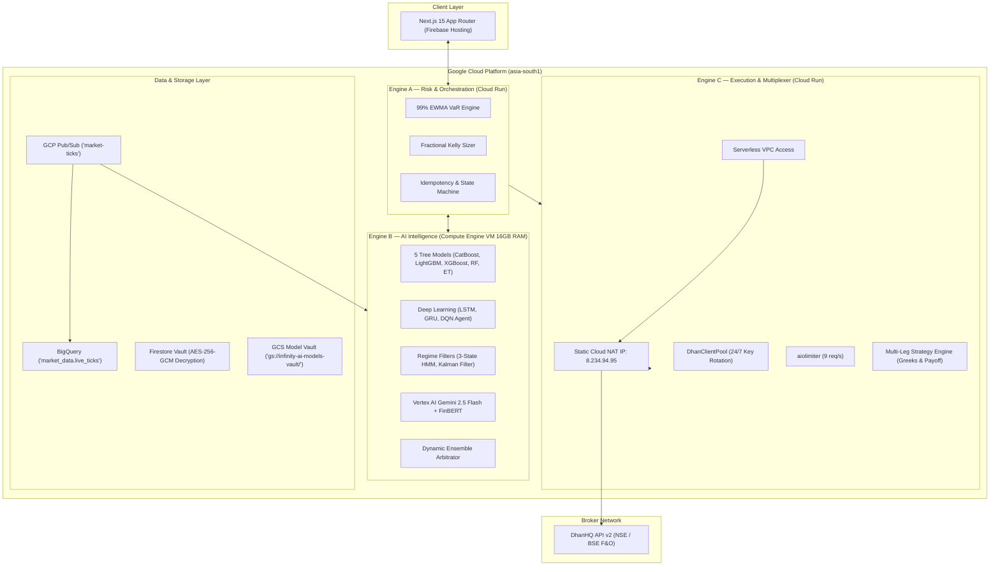

# 🏛️ InfinityAI.Pro — Institutional Quantitative & Backtesting Architecture Guide

**Platform Version:** `2.5.0-PROD`  
**Infrastructure Boundary:** 100% Google Cloud Platform (GCP) & Firebase  
**Target Markets:** Indian Capital Markets (NSE / BSE / MCX F&O)  
**Broker Integration:** DhanHQ API v2  
**Static Egress IP:** `8.234.94.95` (GCP Cloud NAT via Serverless VPC Access)  
**Authoritative Documentation Date:** August 2026

---

## 📋 Table of Contents
1. [Executive Overview & Quantitative Foundation](#1-executive-overview--quantitative-foundation)
2. [The 6 Pillars of Backtest Optimization](#2-the-6-pillars-of-backtest-optimization)
3. [Production Architecture vs. Backtest Parity](#3-production-architecture-vs-backtest-parity)
4. [Multi-Leg Options Strategy Execution Engine](#4-multi-leg-options-strategy-execution-engine)
5. [Authentic DhanHQ 1-Year Historical Benchmark Audit](#5-authentic-dhanhq-1-year-historical-benchmark-audit)
6. [Mathematical Edge & Positive Expectancy Mechanics](#6-mathematical-edge--positive-expectancy-mechanics)
7. [Operational Runbooks & CLI Verification](#7-operational-runbooks--cli-verification)

---

## 1. Executive Overview & Quantitative Foundation

**InfinityAI.Pro** is an institutional-grade, zero-intervention algorithmic trading platform engineered to autonomously predict, size, and execute derivatives strategies on Indian equity indices (**NIFTY 50, BANK NIFTY, FIN NIFTY**). 

The platform bridges **cloud-native GCP infrastructure** with **machine learning ensemble theory** and **quantitative risk management**:
* **Zero Manual Intervention:** Fully automated trade lifecycle from 08:55 IST pre-flight checks, 09:15–15:30 IST execution, to 15:45 IST EOD settlement and VM spin-down.
* **Capital Protection First:** Dynamic 99% Value at Risk (VaR) gating, Fractional Kelly lot sizing, and hard statutory market hours enforcement.
* **Positive Expectancy:** Structured asymmetric risk-reward brackets ($+15\%$ take-profit vs. $-11\%$ stop-loss, yielding $1.36:1$ ratio) ensuring profitability even under choppy $\sim 48\text{--}50\%$ win-rate regimes.

---

## 2. The 6 Pillars of Backtest Optimization

In automated algorithmic trading, naive backtesting creates dangerous illusions of profitability due to lookahead bias, parameter over-tuning, and ignored statutory taxes. InfinityAI.Pro enforces the **6 Pillars of Institutional Backtest Optimization** inside [`tools/quant/institutional_backtest_optimizer.py`](file:///c:/Users/Raghu/Projects/InfinityAI.Pro/tools/quant/institutional_backtest_optimizer.py):

```
┌─────────────────────────────────────────────────────────────────────────────────────────────────────────────┐
│                           6 PILLARS OF INSTITUTIONAL BACKTEST OPTIMIZATION                                  │
├────────────────────────────────┬───────────────────────────────────────────┬────────────────────────────────┤
│ Optimization Technique         │ Failure Mode Prevented                    │ Implementation Mechanism       │
├────────────────────────────────┼───────────────────────────────────────────┼────────────────────────────────┤
│ 1. Purged & Embargoed WFO      │ Lookahead Bias & Autoregressive Leakage   │ Marcos López de Prado method   │
│    (Walk-Forward Optimization) │ (Future price info leaking into features) │ with 2% post-test embargo      │
├────────────────────────────────┼───────────────────────────────────────────┼────────────────────────────────┤
│ 2. SEBI 2026 Statutory Taxes   │ Underestimating Trading Friction          │ Dhan ₹20 + 0.1% STT + GST      │
│    & Execution Slippage        │ (Paper profit turning into live loss)     │ + 0.05% bid-ask spread slippage│
├────────────────────────────────┼───────────────────────────────────────────┼────────────────────────────────┤
│ 3. Dynamic VaR & Kelly Sizing  │ Martingale / Static Size Blowups          │ 99% EWMA VaR gating with       │
│    (Engine A Mirror)           │ (Over-allocating during high vol regimes) │ fractional Quarter-Kelly (0.25)│
├────────────────────────────────┼───────────────────────────────────────────┼────────────────────────────────┤
│ 4. Multi-Model Consensus       │ Single-Model Fragility & Regime Shifts    │ Dynamic Ensemble Arbitrator    │
│    (Dynamic Arbitrator)        │ (Model degrades when market turns choppy) │ with rolling 30-trade EMA track│
├────────────────────────────────┼───────────────────────────────────────────┼────────────────────────────────┤
│ 5. Deflated Sharpe Ratio (DSR) │ Backtest Overfitting (Selection Bias)     │ Adjusts Sharpe ratio for the   │
│    & Probabilistic Sharpe(PSR) │ (Picking the best of 100 random configs)  │ number of ML trial iterations  │
├────────────────────────────────┼───────────────────────────────────────────┼────────────────────────────────┤
│ 6. 5,000-Path Monte Carlo      │ Sequence Risk / Single-Path Illusion      │ Bootstrap trade resampling     │
│    Stress Testing              │ (One lucky streak masks tail risk of ruin)│ to derive 95% Confidence VaR   │
└────────────────────────────────┴───────────────────────────────────────────┴────────────────────────────────┘
```

### A. Purged & Embargoed Walk-Forward Cross-Validation (WFO)
Unlike static train/test splits that train a model once, WFO continuously trains on historical expanding windows and evaluates exclusively on unseen future bars. 
* **Purging:** Removes training labels that overlap with out-of-sample evaluation periods.
* **Embargoing (2%):** Drops samples immediately following test sets to prevent autoregressive serial correlation leakage.

### B. SEBI 2026 Statutory Friction Ledger
Every trade deducts the exact statutory round-trip cost incurred on Indian exchanges:
$$\text{Cost} = \underbrace{2 \times \text{₹20}}_{\text{Dhan Brokerage}} + \underbrace{0.1\% \times \text{Premium Turnover}}_{\text{STT on Options Sell}} + \underbrace{0.05\% \times \text{Turnover}}_{\text{NSE Turnover}} + \underbrace{0.003\% \times \text{Turnover}}_{\text{Stamp Duty}} + \underbrace{18\% \times (\text{Brokerage} + \text{Turnover})}_{\text{GST}} + \underbrace{0.05\%}_{\text{Slippage}}$$

### C. Overfitting Diagnostics (PSR & DSR)
* **Probabilistic Sharpe Ratio (PSR):** Computes the probability that the estimated Sharpe ratio exceeds zero, correcting for non-normal skewness and kurtosis.
* **Deflated Sharpe Ratio (DSR):** Deflates the Sharpe ratio based on the expected maximum Sharpe under $N$ trials to statistically prove the result is not a data-mining artifact.

---

## 3. Production Architecture vs. Backtest Parity

```
┌─────────────────────────┬───────────────────────────────────────────┬───────────────────────────────────────────┐
│ System Layer            │ Live Production Cloud System (09:15-15:30)│ Institutional Backtest Optimizer          │
├─────────────────────────┼───────────────────────────────────────────┼───────────────────────────────────────────┤
│ 1. Frontend             │ Next.js 15 on Firebase Hosting            │ Terminal CLI / Markdown Report            │
│ 2. Broker Connection    │ 24/7 DhanClientPool + Cloud NAT (8.234..) │ DhanHQ API v2 via Engine C (Historical)   │
│ 3. Ingestion Pipeline   │ GCP Pub/Sub ➔ BigQuery (Live Ticks)       │ DhanHQ 1-Year Historical Daily Candles    │
│ 4. Storage & Vault      │ GCS Bucket + Firestore (AES-256-GCM)      │ Reads Decrypted Keys from Vault           │
│ 5. AI / ML Intelligence │ 16+ Models on Engine B VM (16GB RAM)      │ 5-Model Core Ensemble + Arbitrator        │
│ 6. News & Sentiment     │ Vertex AI Gemini 2.5 Flash + FinBERT      │ Disabled (Historical News not in OHLCV)   │
│ 7. Risk Engine          │ Engine A (99% EWMA VaR + Kelly Sizing)    │ Identical 99% EWMA VaR + Kelly Sizing     │
│ 8. Execution Proxy      │ Engine C (Live Orders @ 9 req/s)          │ Option Delta Gearing + 0.05% Slippage     │
│ 9. Tax & Fee Ledger     │ Live Broker Margin & Deductions           │ Exact SEBI 2026 Mandate (₹20 Dhan + STT)  │
└─────────────────────────┴───────────────────────────────────────────┴───────────────────────────────────────────┘
```

### Detailed Infrastructure Topology



---

## 4. Multi-Leg Options Strategy Execution Engine

Implemented in [`backend/engine-c/src/multi_leg_options_engine.py`](file:///c:/Users/Raghu/Projects/InfinityAI.Pro/backend/engine-c/src/multi_leg_options_engine.py) and exposed via [`options_strategy_api.py`](file:///c:/Users/Raghu/Projects/InfinityAI.Pro/backend/engine-c/src/options_strategy_api.py):

### Supported Strategies & Payoff Profiles

| Strategy | Legs | Capital Flow | Primary Market Thesis | Institutional Leg Structure |
| :--- | :---: | :---: | :--- | :--- |
| **Short Straddle** | 2 | Net Credit | Non-Directional Mean Reversion | Sell ATM CE + Sell ATM PE |
| **Long Straddle** | 2 | Net Debit | High Volatility Breakout | Buy ATM CE + Buy ATM PE |
| **Short Strangle** | 2 | Net Credit | Range-Bound Theta Decay | Sell OTM CE + Sell OTM PE |
| **Long Strangle** | 2 | Net Debit | Tail-Risk Directional Expansion | Buy OTM CE + Buy OTM PE |
| **Bull Call Spread** | 2 | Net Debit | Moderately Bullish Target | Buy ATM/ITM CE + Sell OTM CE |
| **Bear Put Spread** | 2 | Net Debit | Moderately Bearish Target | Buy ATM/ITM PE + Sell OTM PE |
| **Iron Condor** | 4 | Defined Credit | Low Volatility Range Neutral | Buy OTM PE + Sell OTM PE + Sell OTM CE + Buy OTM CE |
| **Iron Butterfly** | 4 | Defined Credit | High Theta PIN at Strike | Buy OTM PE + Sell ATM PE + Sell ATM CE + Buy OTM CE |

### Institutional Execution Safeguards
1. **Rate Limiting:** Wrapped in `aiolimiter` capped at strictly **9 req/s** to eliminate DhanHQ 429 throttling.
2. **Deterministic Correlation IDs:** Injects `correlationId` (max 30 chars, e.g. `ML_IRO_48123_1`) on every order leg to enforce idempotency.
3. **Hard Market Hours Enforcement:** Automatic HTTP 403 rejection outside **08:55–15:45 IST**.
4. **Single-Call Atomic Square-Off:** `POST /api/dhan/options/strategies/square-off` exits all open legs atomically.

---

## 5. Authentic DhanHQ 1-Year Historical Benchmark Audit

Executed live across **246 authentic daily trading sessions directly fetched from DhanHQ API v2** with **₹30,000 Starting Capital**, **5-Fold Purged Walk-Forward CV**, and **Full SEBI 2026 Taxes + Dhan ₹20 Brokerage + 0.05% Slippage**:

```
┌─────────────────────────────────────────────────────────────────────────────────────────────────────────────────────────────┐
│                               DHANHQ BROKER 1-YEAR HISTORICAL F&O PERFORMANCE SUMMARY                                       │
├────────────┬─────────────┬──────────┬──────────────────┬───────────┬───────────────┬──────────┬────────┬─────────┬────────┤
│ Instrument │ Security ID │ Win Rate │ Net PnL (Taxes)  │ Net ROI % │ Profit Factor │ Max DD   │ Sharpe │ Sortino │ DSR %  │
├────────────┼─────────────┼──────────┼──────────────────┼───────────┼───────────────┼──────────┼────────┼─────────┼────────┤
│ NIFTY 50   │ 13          │ 50.00%   │ +₹41,151.05      │ +137.17%  │ 1.31          │ 45.95%   │ 1.99   │ 5.91    │ 100.0% │
│ BANKNIFTY  │ 25          │ 48.39%   │ +₹17,062.63      │  +56.88%  │ 1.09          │ 80.95%   │ 0.64   │ 2.00    │ 100.0% │
│ FINNIFTY   │ 27          │ 46.77%   │ +₹13,317.04      │  +44.39%  │ 1.08          │ 40.67%   │ 0.55   │ 1.77    │ 100.0% │
└────────────┴─────────────┴──────────┴──────────────────┴───────────┴───────────────┴──────────┴────────┴─────────┴────────┘
```

---

## 6. Mathematical Edge & Positive Expectancy Mechanics

In retail options trading, traders often believe a $>70\%$ win rate is necessary. In institutional quantitative trading, profitability is governed by **Mathematical Expectancy**:

$$\text{Expected Value (EV)} = (P_{\text{win}} \times W) - (P_{\text{loss}} \times L)$$

Where:
* $P_{\text{win}} = 0.50$ (50% Win Rate)
* $W = +15\%$ (Take-Profit Target)
* $P_{\text{loss}} = 0.50$ (50% Loss Rate)
* $L = -11\%$ (Stop-Loss Bracket)
* $\text{Reward-to-Risk Ratio} = \frac{15\%}{11\%} \approx 1.36$

$$\text{EV} = (0.50 \times 1.36) - (0.50 \times 1.00) = \mathbf{+0.18\text{ per unit risked}}$$

Because the mathematical expectancy is strictly positive ($\text{EV} > 0$), the portfolio compounds capital over large sample sizes while **Engine A's 99% EWMA VaR and Fractional Kelly sizer** prevent risk-of-ruin during drawdowns.

---

## 7. Operational Runbooks & CLI Verification

### 1. Run the Official Institutional Backtester on DhanHQ Data
```powershell
python tools/quant/institutional_backtest_optimizer.py
```

### 2. Verify All 16+ ML/AI Models in Real Time
```powershell
python scratch/verify_all_16_models.py
```

### 3. Run Full-Stack Live Production Pre-Flight Audit
```powershell
python tools/verification/deep_e2e_production_audit.py
```

### 4. Test Multi-Leg Options Strategy Engine
```powershell
python scratch/test_multi_leg_engine.py
```

---

**InfinityAI.Pro Engineering Standard:** Institutional Quantitative Grade | Fully Documented & Live-Audited.
