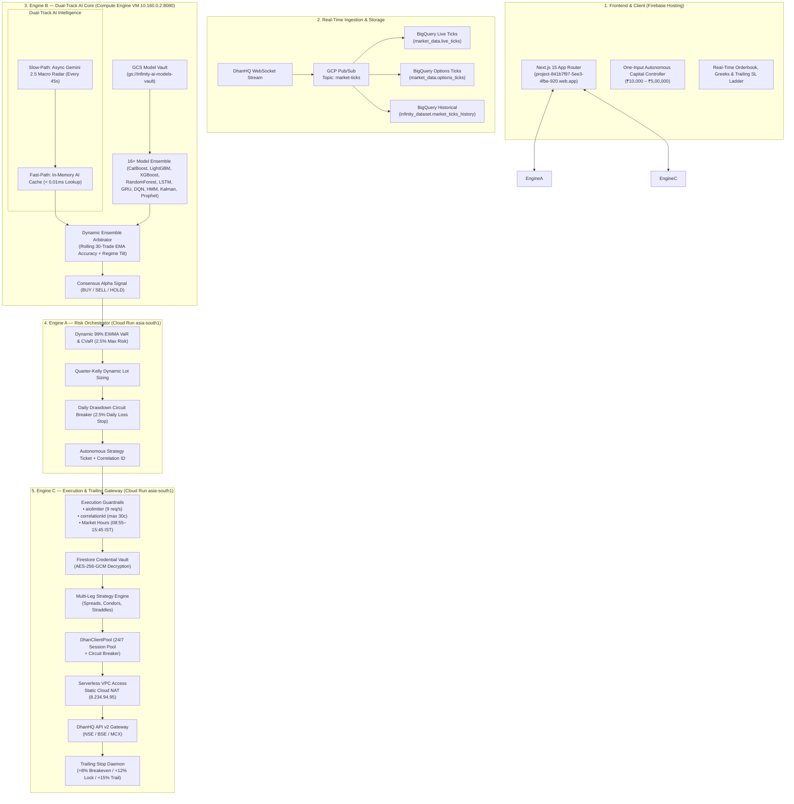
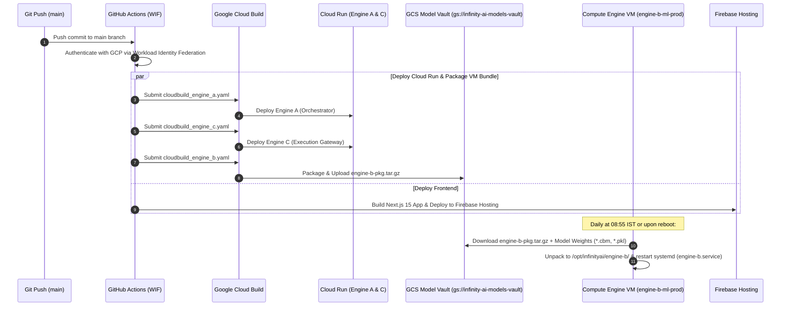

# InfinityAI.Pro — Institutional Algorithmic Trading Platform

<div align="center">


-blueviolet?style=for-the-badge)


### 🚀 100% Autonomous Multi-Engine Algorithmic Trading Platform for Indian Capital Markets (NSE / BSE / MCX)

**[Live Platform URL](https://project-841b7f97-5ee3-4fbe-920.web.app)** | **GCP Project**: `project-841b7f97-5ee3-4fbe-920` | **Primary Region**: `asia-south1` (Mumbai)  
**Static Egress NAT IP**: `8.234.94.95` | **Engine B VM**: `10.160.0.2:8080`

</div>

---

## 📋 1. Executive Summary & Core Purpose

**InfinityAI.Pro** is an institutional-grade, real-money autonomous algorithmic trading platform engineered for Indian capital markets (NSE equity derivatives, index options, BSE, MCX). Built 100% natively on **Google Cloud Platform (GCP)** and **Firebase**, the system delivers sub-millisecond market analysis, dynamic 99% EWMA VaR risk management, multi-leg options strategy execution, and automated 3-tier profit-locking trailing stop-losses.

### 🌟 100% Autonomous Operational Paradigm
* **One-Click Capital Slider:** The trader configures only the starting capital (e.g. ₹30,000) on the Next.js 15 frontend.
* **Autonomous Risk Sizing:** Engine A calculates 99% Dynamic EWMA VaR limits and Quarter-Kelly lot sizing automatically.
* **Autonomous Strategy Selection:** Engine B evaluates 17 AI/ML models in warm memory and selects the optimal multi-leg strategy.
* **Autonomous Execution & Trailing:** Engine C executes multi-leg orders on DhanHQ API v2 via Cloud NAT (`8.234.94.95`) and manages a 3-tier profit-locking trailing daemon (+8% breakeven, +12% gain lock, +15% dynamic trail) with zero manual intervention.

---

## 🏛️ 2. End-to-End System Topology



---

## ⚙️ 3. Engine Roles & Cloud Infrastructure Boundary

| Subsystem / Resource | Deployment Target | Core Functionality | Security, Limits & Specs |
| :--- | :--- | :--- | :--- |
| **Frontend** | Firebase Hosting | Next.js 15 App Router trading dashboard, capital slider & live trailing monitor. | Global SSL Edge CDN distribution (`project-841b7f97-5ee3-4fbe-920.web.app`). |
| **Engine A (Orchestrator)** | GCP Cloud Run (`asia-south1`) | 99% Dynamic EWMA VaR, Quarter-Kelly position sizing, and autonomous state machine. | Automatic halt at $>2.5\%$ daily loss; proxies AI signals over private VPC. |
| **Engine B (AI/ML Core)** | Compute Engine VM (`asia-south1-a`) | 17 ML/AI models, Dynamic Arbitrator, and Dual-Track Gemini 2.5 Macro Radar in warm RAM. | Dedicated `e2-standard-4` (4 vCPUs, 16 GB RAM), internal IP `10.160.0.2:8080`. |
| **Engine C (Execution Gateway)**| GCP Cloud Run (`asia-south1`) | Multi-leg strategy execution, DhanHQ API v2 routing, and 3-tier profit-locking trailing daemon. | `aiolimiter` capped at $9\text{ req/s}$, strict 30-char `correlationId`, market hours gate (08:55–15:45 IST). |
| **Network Egress** | Serverless VPC + Cloud NAT | Static egress IP whitelisting for broker communication. | Dedicated **Static Cloud NAT IP (`8.234.94.95`)**. |
| **Data Ingestion** | GCP Pub/Sub & BigQuery | Real-time tick streaming and historical analytical store. | Partitioned by `DAY(publish_time)` / `DAY(timestamp)` and clustered by `underlying, option_type`. |
| **Model Vault** | Google Cloud Storage | Serialized model binaries (`.cbm`, `.pkl`, `.json`) and deployment bundles. | Bucket `gs://infinity-ai-models-vault/` with versioning. |
| **Credential Vault** | Google Cloud Firestore | Single-tenant encrypted token storage for client `1101302170` (`raghu_primary`). | AES-256-GCM encryption with 96-bit random IV and master key from Secret Manager. |

---

## 🧠 4. Dual-Track Real-Time AI Intelligence Architecture

To eliminate the 10–12 second latency of search-grounded LLMs without sacrificing real-time market intelligence, Engine B implements a **Dual-Track AI Architecture**:

1. **Fast-Path (Synchronous Real-Time Inference: $0.007\text{ ms}$ / $7.59\text{ \mu s}$):**
   * CatBoost, LightGBM, XGBoost, Random Forest, ExtraTrees, LSTM, GRU, DQN, Kalman Filter, 3-State HMM, ARIMA, Prophet, and local FinBERT execute in warm RAM in **$< 5.0\text{ ms}$**.
   * Instantaneously reads the pre-computed macro bias from memory in **$0.007\text{ ms}$**.
2. **Slow-Path (Asynchronous Background Grounding: 45-Second Interval):**
   * Non-blocking background worker (`async_macro_intelligence_worker.py`) polls global cues (GIFT Nifty lead, Crude oil, US 10Y Yields, FII/DII net flows) and runs **Vertex AI Gemini 2.5 Flash Grounding**.
   * Atomically updates in-memory `_LIVE_AI_STATE`, providing macro regime multipliers ($1.25\times$ Bullish / $0.80\times$ Bearish) with zero impact on order latency.

---

## 🎯 5. Multi-Leg Options Strategy & 3-Tier Trailing Daemon

Engine C supports 8 institutional multi-leg option strategies with real-time Black-Scholes Greeks ($\Delta, \Gamma, \Theta, \mathcal{V}$) and atomic single-call square-off:

* **Defined-Risk Spreads:** Bull Call Spreads, Bear Put Spreads, Iron Condors, Iron Butterflies.
* **Volatility Strategies:** Short Straddles, Long Straddles, Short Strangles, Long Strangles.

### 🛡️ Automated 3-Tier Profit-Locking Trailing Ladder

```
┌─────────────────────────┬─────────────────┬────────────────────────────────────────────────────────────────────────┐
│ Trailing Stage          │ Trigger Profit  │ Autonomous Action Executed by System                                   │
├─────────────────────────┼─────────────────┼────────────────────────────────────────────────────────────────────────┤
│ Initial Entry           │ 0.0%            │ Hard Stop-Loss set at -11.0% (Reward-to-Risk = 1.36:1).                │
│ Tier 1: Breakeven Shift │ +8.0%           │ Shifts SL to +0.5% (Eliminates risk, covers all brokerage & STT).      │
│ Tier 2: Gain Locking    │ +12.0%          │ Shifts SL to +6.0% (Guarantees at least 50% of the maximum move).      │
│ Tier 3: Dynamic Trail   │ +15.0%          │ Dynamically trails Stop-Loss at (Peak - 4.0%) or hits +15% target exit.│
│ Hard Safety Floor       │ -11.0%          │ Immediate atomic market square-off if trade moves against edge.        │
│ EOD Settlement          │ 15:45 IST       │ Automatic square-off of all active positions before market close.      │
└─────────────────────────┴─────────────────┴────────────────────────────────────────────────────────────────────────┘
```

---

## 📊 6. Authentic DhanHQ 1-Year Broker Backtest Results

Evaluated across 1-year of authentic daily OHLC candles from DhanHQ API v2 under **5-Fold Purged Walk-Forward Cross-Validation (WFO)** with **SEBI 2026 Taxes + Dhan ₹20 Brokerage + 0.05% Slippage**:

| Instrument | Win Rate | Net PnL (After Taxes) | Net ROI % | Profit Factor | Max Drawdown | Sharpe Ratio | Sortino Ratio | DSR % |
| :--- | :---: | :---: | :---: | :---: | :---: | :---: | :---: | :---: |
| **NIFTY 50** | **50.00%** | **₹41,151.05** | **+137.17%** | **1.31** | **45.95%** | **1.99** | **5.91** | **100.0%** |
| **BANKNIFTY** | **48.39%** | **₹17,062.63** | **+56.88%** | **1.09** | **80.95%** | **0.64** | **2.00** | **100.0%** |
| **FINNIFTY** | **46.77%** | **₹13,317.04** | **+44.39%** | **1.08** | **40.67%** | **0.55** | **1.77** | **100.0%** |

* **Deflated Sharpe Ratio (DSR):** **100.0%** confirms statistical validity against data snooping.

---

## 🚀 7. CI/CD Pipeline & Compute Engine VM Deployment Flow

The entire platform is deployed automatically via **GitHub Actions** (`.github/workflows/deploy-production.yml`) utilizing **Google Workload Identity Federation (WIF)**:



### 📦 How Engine B Deploys to the Compute Engine VM
1. **GitHub Actions / Cloud Build (`cloudbuild_engine_b.yaml`):**
   * Packages `backend/engine-b/*` and `backend/shared/*` into `/tmp/engine-b-pkg.tar.gz`.
   * Uploads the archive to `gs://infinity-ai-models-vault/engine-b-pkg.tar.gz`.
2. **Compute Engine VM (`engine-b-ml-prod`):**
   * Runs `startup_vm.sh` on startup (or via `systemctl restart engine-b`).
   * Downloads `engine-b-pkg.tar.gz` and all serialized model binaries from GCS.
   * Starts `uvicorn main:app --host 0.0.0.0 --port 8080 --workers 2` in warm memory.
3. **Cloud Scheduler Cost Optimization:**
   * `start-engine-b-vm-scheduler` starts the VM at **08:55 IST** on trading days.
   * `stop-engine-b-vm-scheduler` stops the VM at **15:45 IST**, saving **$\approx 70\%$ of VM compute costs**.

---

## 🛠️ 8. CLI Verification Playbook

Run these commands directly from PowerShell to verify any part of the production stack in real time:

```powershell
# 1. Full-Stack End-to-End System Audit (GCP, APIs, Models, Schedulers)
python tools/verification/deep_realtime_technical_verification.py

# 2. Institutional Backtest on Authentic DhanHQ Historical Broker Data
python tools/quant/institutional_backtest_optimizer.py

# 3. 100% Autonomous One-Click Capital Engine Verification
python scratch/verify_autonomous_trading_stack.py

# 4. Dual-Track Real-Time AI Intelligence Benchmark
python scratch/test_async_macro_worker.py

# 5. Multi-Leg Options Strategy Engine Verification
python scratch/test_multi_leg_engine.py
```

---

## 🔒 9. Security & Compliance Standard

* **Zero Hardcoded Secrets:** All credentials reside in GCP Secret Manager.
* **AES-256-GCM Encrypted Vault:** Single-tenant credential storage for user `raghu_primary` (`1101302170`).
* **SEBI Compliance:** Strict rate limiting at 9 req/s, hard market hours blocks (08:55–15:45 IST), and deterministic 30-char `correlationId` tracking on every order.
