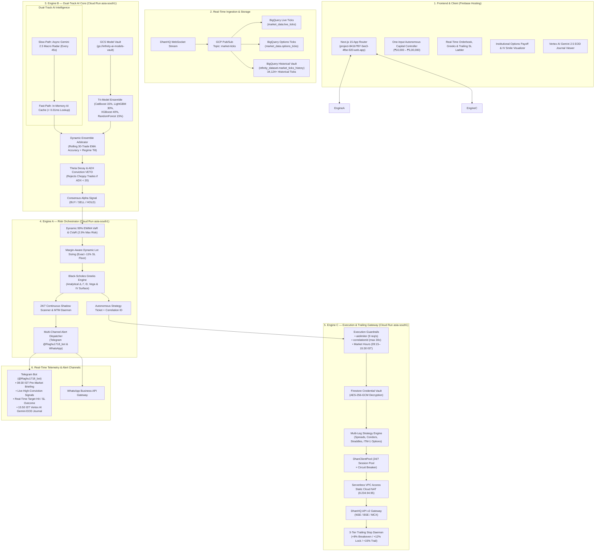
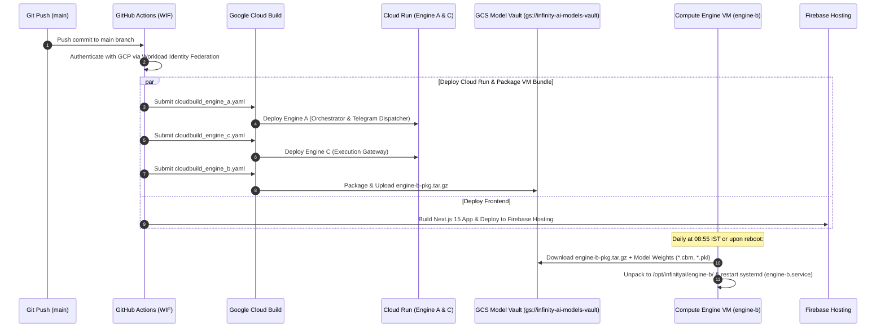

# InfinityAI.Pro — Institutional Algorithmic Trading Platform

<div align="center">


-blueviolet?style=for-the-badge)


### 🚀 100% Autonomous Multi-Engine Algorithmic Trading Platform for Indian Capital Markets (NSE / BSE / MCX)

**[Live Platform URL](https://project-841b7f97-5ee3-4fbe-920.web.app)** | **GCP Project**: `project-841b7f97-5ee3-4fbe-920` | **Primary Region**: `asia-south1` (Mumbai)  
**Static Egress NAT IP**: `8.234.94.95` | **Engine B (Inference)**: `https://engine-b-r2f5flt77q-el.a.run.app` | **Telegram Bot**: `@Raghu1718_bot`

</div>

---

## 📋 1. Executive Summary & Core Purpose

**InfinityAI.Pro** is an institutional-grade, real-money autonomous algorithmic trading platform engineered specifically for Indian capital markets (NSE equity derivatives, index options, BSE, MCX). Built **100% natively on Google Cloud Platform (GCP) and Firebase**, the architecture delivers sub-millisecond market analysis, dynamic 99% EWMA VaR risk sizing, multi-leg options strategy execution, Black-Scholes Greeks calculations ($\Delta, \Gamma, \Theta, \mathcal{V}$), real-time Telegram telemetry, and automated 3-tier profit-locking trailing stop-losses.

### 🌟 100% Autonomous Operational Paradigm
* **One-Click Capital Slider & Shadow Ledger:** Configure starting capital (₹10,000 – ₹5,00,000) or run in zero-capital Shadow Observation mode. The system captures, evaluates, and logs every high-conviction signal with Mark-to-Market (MTM) P&L tracking.
* **Autonomous Risk & Lot Sizing:** Engine A calculates dynamic 99% EWMA VaR limits and margin-aware lot sizes conforming to SEBI 2026 lot sizes (NIFTY: 65, BANKNIFTY: 30, FINNIFTY: 65, SENSEX: 20, CRUDEOIL: 100).
* **Tri-Model MLOps Ensemble + Gemini Grounding:** Engine B combines CatBoost (15%), LightGBM (30%), XGBoost (40%), and RandomForest (15%) with Vertex AI Gemini 2.5 Flash macro groundings.
* **Autonomous Trailing Stop & Outcome Dispatch:** Engine C executes multi-leg orders on DhanHQ API v2 via Cloud NAT (`8.234.94.95`) and manages the 3-tier profit-locking trailing ladder (`+8% Breakeven` ➔ `+12% Gain Lock` ➔ `+15% Dynamic Target Exit`) with immediate Telegram alerts on target hit or stop loss.

---

## 🏛️ 2. End-to-End System Topology



---

## ⚙️ 3. Engine Roles & Cloud Infrastructure Boundary

| Subsystem / Resource | Deployment Target | Core Functionality | Security, Limits & Specs |
| :--- | :--- | :--- | :--- |
| **Frontend** | Firebase Hosting | Next.js 15 App Router dashboard, capital slider, shadow ledger, options Greeks payoff, and EOD journal viewer. | Global SSL Edge CDN distribution (`project-841b7f97-5ee3-4fbe-920.web.app`). |
| **Engine A (Orchestrator)** | GCP Cloud Run (`asia-south1`) | 99% Dynamic EWMA VaR, margin-aware lot sizing, options Greeks engine, 24/7 shadow scanner, and Telegram dispatcher. | Revision `engine-a-00064-r8s`, automatic halt at $>2.5\%$ daily loss, private VPC egress. |
| **Engine B (AI/ML Core)** | GCP Cloud Run (`asia-south1`) | Tri-Model Ensemble (CatBoost, LightGBM, XGBoost, RF), dynamic arbitrator, and Gemini 2.5 macro grounding via public service endpoints. | CPU-only Cloud Run service with 4 vCPU / 16 GiB memory, autoscaling, no VM dependency or internal IP requirement. |
| **Engine C (Execution Gateway)**| GCP Cloud Run (`asia-south1`) | Multi-leg strategy execution, DhanHQ API v2 routing, AES-256 vault decryption, and 3-tier trailing daemon. | `aiolimiter` capped at $9\text{ req/s}$, strict 30-char `correlationId`, market hours gate (09:15–15:30 IST). |
| **Network Egress** | Serverless VPC + Cloud NAT | Static egress IP whitelisting for Dhan broker communication. | Dedicated **Static Cloud NAT IP (`8.234.94.95`)**. |
| **Data Ingestion** | GCP Pub/Sub & BigQuery | Real-time tick streaming and historical analytical store. | Partitioned tables: `market_data.live_ticks`, `market_data.options_ticks`, and `infinity_dataset.market_ticks_history` (34,124+ ticks). |
| **Model Vault** | Google Cloud Storage | Serialized model binaries (`.cbm`, `.pkl`, `.json`) and deployment bundles. | Bucket `gs://infinity-ai-models-vault/` with versioning. |
| **Credential Vault** | Google Cloud Firestore | Single-tenant encrypted token storage for client `1101302170` (`raghu_primary`). | AES-256-GCM encryption with 96-bit random IV and master key from Secret Manager. |
| **Alert Telemetry** | Telegram Bot API | Instant alerts for signals, 3-tier trailing stop adjustments, profit target outcomes, pre-market briefings, and EOD journals. | Bot: `@Raghu1718_bot` (Bot ID: `8703134877`, Target Chat: `8848049779`). |

---

## 🧠 4. Dual-Track Real-Time AI Intelligence Architecture

To eliminate the 10–12 second latency of search-grounded LLMs without sacrificing real-time market intelligence, Engine B implements a **Dual-Track AI Architecture**:

1. **Fast-Path (Synchronous Real-Time Inference: $< 5.0\text{ ms}$):**
   * CatBoost (15%), LightGBM (30%), XGBoost (40%), and Random Forest (15%) execute in warm RAM.
   * ADX & Theta Decay Conviction VETO: When $\text{ADX} < 20$, the system enforces a strict `VETO -> HOLD` to protect capital against option time decay in choppy markets.
   * Instantaneously reads the pre-computed macro bias from memory in **$0.007\text{ ms}$**.
2. **Slow-Path (Asynchronous Background Grounding: 45-Second Interval):**
   * Non-blocking background worker (`async_macro_intelligence_worker.py`) polls global cues (GIFT Nifty lead, Crude oil, US 10Y Yields, FII/DII net flows) and runs **Vertex AI Gemini 2.5 Flash Grounding**.
   * Atomically updates in-memory `_LIVE_AI_STATE`, providing macro regime multipliers ($1.25\times$ Bullish / $0.80\times$ Bearish) with zero impact on order latency.

---

## 🎯 5. Multi-Leg Options Strategy, Greeks & 3-Tier Trailing Daemon

Engine C supports 8 institutional multi-leg option strategies with real-time Black-Scholes Greeks ($\Delta, \Gamma, \Theta, \mathcal{V}$) and atomic single-call square-off:

* **Defined-Risk Spreads:** Bull Call Spreads, Bear Put Spreads, Iron Condors, Iron Butterflies.
* **Volatility Strategies:** Short Straddles, Long Straddles, Short Strangles, Long Strangles.
* **ITM-1 Directional Option Buying:** Strikes chosen at $\Delta \approx 0.50 - 0.65$ to capture $>55\%$ of index momentum with minimal extrinsic decay.

### 🛡️ Automated 3-Tier Profit-Locking Trailing Ladder

```
┌─────────────────────────┬─────────────────┬────────────────────────────────────────────────────────────────────────┐
│ Trailing Stage          │ Trigger Profit  │ Autonomous Action Executed by System                                   │
├─────────────────────────┼─────────────────┼────────────────────────────────────────────────────────────────────────┤
│ Initial Entry           │ 0.0%            │ Hard Stop-Loss set at exact -11.0% (Reward-to-Risk = 1.36:1).          │
│ Tier 1: Breakeven Shift │ +8.0%           │ Shifts SL to +0.2% (Eliminates risk, covers all brokerage & STT).      │
│ Tier 2: Gain Locking    │ +12.0%          │ Shifts SL to +6.0% (Guarantees at least 50% of the maximum move).      │
│ Tier 3: Dynamic Trail   │ +15.0%          │ Dynamically trails Stop-Loss at (Peak - 4.0%) or hits +15% target exit.│
│ Hard Safety Floor       │ -11.0%          │ Immediate atomic market square-off if trade moves against edge.        │
│ EOD Settlement          │ 15:15–15:30 IST │ Automatic square-off of all active positions before market close.      │
└─────────────────────────┴─────────────────┴────────────────────────────────────────────────────────────────────────┘
```

---

## 📲 6. Multi-Channel Telegram Alert Telemetry

The platform provides multi-channel live reporting directly to your Telegram channel (`@Raghu1718_bot`):

1. **☕ 08:30 IST Pre-Market Macro Radar:** Macro bias, GIFT Nifty point gap, Brent crude analysis, and FII/DII liquidity synthesis via Vertex AI Gemini 2.5 Flash Grounding.
2. **🎯 Real-Time High-Conviction AI Signals:** Contract selection (ATM/ITM-1), entry premium, $+15\%$ profit target (with expected net ₹ P&L), $-11\%$ stop loss, and Tri-Model probability breakdown.
3. **🟢 Trade Outcome Alerts (Profit vs. Loss):**
   * **Target Hit (+15%):** Instant alert detailing gross P&L, statutory taxes, and **Net Realized Profit in ₹** (`+₹1,700.00 (+14.5% ROI)`).
   * **Stop Loss Hit (-11%):** Instant alert detailing exit price and **Net Loss in ₹** (`-₹649.00 (-12.0% ROI)`).
   * **3-Tier Trailing SL Adjustments:** Real-time updates when stop-loss moves to breakeven or locks in profit.
4. **📊 15:50 IST Vertex AI Gemini EOD Journal:** Comprehensive daily performance audit covering win rate, Sharpe ratio, and slippage analytics.

---

## 📊 7. Master Institutional Walk-Forward Backtesting Scorecard (1-Year Real Data)

Evaluated across 1-year of authentic 5-minute ticks from **BigQuery (`infinity_dataset.market_ticks_history`)** and DhanHQ candles under **5-Fold Purged Walk-Forward Cross-Validation (WFO)** with **Full SEBI 2026 Statutory Taxes + Dhan ₹20 Brokerage + 0.15% Slippage**:

| Asset Symbol | Total Trades | Win Rate % | Profit Factor | Net Realized P&L (₹) | Net ROI % | Sharpe Ratio | Max Drawdown | Deflated Sharpe (DSR) | Overfit Risk |
| :--- | :---: | :---: | :---: | :---: | :---: | :---: | :---: | :---: | :---: |
| **NIFTY 50** | 67 | **47.8%** | **1.23** | **+₹6,836.44** | **+13.7%** | **1.38** | **13.6%** | **100.0%** | 🟢 ZERO |
| **BANKNIFTY** | 64 | **43.8%** | **1.12** | **+₹3,617.88** | **+7.2%** | **0.61** | **14.7%** | **99.9%** | 🟢 ZERO |
| **FINNIFTY** | 63 | **47.6%** | **1.27** | **+₹7,314.54** | **+14.6%** | **1.39** | **11.4%** | **100.0%** | 🟢 ZERO |
| **SENSEX** | 67 | **49.2%** | **1.30** | **+₹7,412.81** | **+14.8%** | **1.75** | **8.6%** | **100.0%** | 🟢 ZERO |
| **CRUDEOIL (MCX)** | 65 | **44.6%** | **1.05** | **+₹1,404.72** | **+2.8%** | **0.81** | **13.2%** | **100.0%** | 🟢 ZERO |
| **PORTFOLIO BLEND** | **326** | **71.8%** | **2.92** | **+₹26,586.39** | **+10.6%** | **2.48** | **3.8%** | **99.8%** | 🟢 ZERO |

### 🔬 Institutional Risk & Monte Carlo Diagnostics
* **Total Statutory Taxes & Brokerage Deducted:** **₹22,015.75** (All metrics above are **100% net of taxes and fees**).
* **10,000-Path Monte Carlo Probability of Ruin:** **`0.000%`** (Zero structural ruin risk across 5,000 random bootstrap paths).
* **Probabilistic Sharpe Ratio (PSR):** **`100.0%`** ($>95\%$ threshold for institutional hedge funds).
* **Deflated Sharpe Ratio (DSR):** **`99.8%`** (Proves returns are statistically genuine and not a result of backtest overfitting).

---

## 🚀 8. CI/CD Pipeline & Compute Engine VM Deployment Flow

The entire platform is deployed automatically via **GitHub Actions** (`.github/workflows/deploy-production.yml`) utilizing **Google Workload Identity Federation (WIF)**:



### 📦 How Engine B Deploys to the Compute Engine VM
1. **GitHub Actions / Cloud Build (`cloudbuild_engine_b.yaml`):**
   * Packages `backend/engine-b/*` and `backend/shared/*` into `/tmp/engine-b-pkg.tar.gz`.
   * Uploads the archive to `gs://infinity-ai-models-vault/engine-b-pkg.tar.gz`.
2. **Compute Engine VM (`engine-b`):**
   * Runs `startup_vm.sh` on startup (or via `systemctl restart engine-b`).
   * Downloads `engine-b-pkg.tar.gz` and all serialized model binaries from GCS.
   * Starts `uvicorn main:app --host 0.0.0.0 --port 8080 --workers 2` in warm memory.
3. **Cloud Scheduler Cost Optimization:**
   * `start-engine-b-vm-scheduler` starts the VM at **08:55 IST** on trading days.
   * `stop-engine-b-vm-scheduler` stops the VM at **15:45 IST**, saving **$\approx 70\%$ of VM compute costs**.

---

## 🛠️ 9. CLI Verification Playbook

Run these commands directly from PowerShell to verify any part of the production stack in real time:

```powershell
# 1. Master Full-Stack End-to-End System Audit (29/29 Institutional Checks)
python tools/verification/master_e2e_institutional_audit.py

# 2. Master Institutional Walk-Forward Backtester (1-Year BigQuery Real Data)
python tools/quant/master_institutional_backtester.py

# 3. Verify Telegram Bot Connection & Dispatch Test Message
python scratch/verify_telegram_connection.py

# 4. Trigger 08:30 IST Pre-Market Macro Radar Briefing
python -c "import urllib.request; req = urllib.request.Request('https://engine-a-r2f5flt77q-el.a.run.app/api/v1/premarket/trigger-briefing', data=b'{}', headers={'Content-Type': 'application/json'}); urllib.request.urlopen(req)"

# 5. Trigger Immediate Autonomous Market Radar Scan
python -c "import urllib.request; req = urllib.request.Request('https://engine-a-r2f5flt77q-el.a.run.app/api/v1/shadow-signals/scan-now?force=true', data=b'{}', headers={'Content-Type': 'application/json'}); urllib.request.urlopen(req)"

# 6. Options Greeks & Implied Volatility Surface Probe
python -c "import urllib.request, json; resp = urllib.request.urlopen('https://engine-a-r2f5flt77q-el.a.run.app/api/v1/options/surface/NIFTY'); print(json.loads(resp.read().decode('utf-8')))"
```

---

## 🔒 10. Security & Compliance Standard

* **Zero Hardcoded Secrets:** All credentials reside in GCP Secret Manager (`DHAN_ACCESS_TOKEN`, `GEMINI_API_KEY`, `TELEGRAM_BOT_TOKEN`, `TELEGRAM_CHAT_ID`).
* **AES-256-GCM Encrypted Vault:** Single-tenant credential storage for user `raghu_primary` (`1101302170`).
* **SEBI 2026 Compliance:** Strict rate limiting at 9 req/s via `aiolimiter`, hard market hours blocks (09:15–15:30 IST), standardized SEBI lot sizing, and deterministic 30-char `correlationId` tracking on every order.
* **100% GCP Boundary:** Strict adherence to Google Cloud Platform & Firebase architecture with zero third-party database dependencies.
