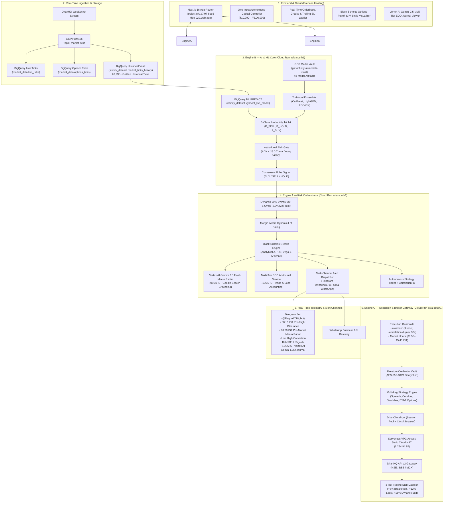

# InfinityAI.Pro — Institutional Algorithmic Trading Platform

<div align="center">


-blueviolet?style=for-the-badge)


### 🚀 100% Autonomous Multi-Engine Algorithmic Trading Platform for Indian Capital Markets (NSE / BSE / MCX)

**[Live Trading Dashboard](https://project-841b7f97-5ee3-4fbe-920.web.app)** | **GCP Project**: `project-841b7f97-5ee3-4fbe-920` | **Primary Region**: `asia-south1` (Mumbai)  
**Static Cloud NAT Egress IP**: `8.234.94.95` | **Engine B (Inference)**: `https://engine-b-r2f5flt77q-el.a.run.app` | **Telegram Bot**: `@Raghu1718_bot`

</div>

---

## 📋 1. Executive Summary & Core Purpose

**InfinityAI.Pro** is an institutional-grade algorithmic trading platform executing real-money and high-fidelity shadow trading on Indian capital markets (NSE equity derivatives, index options, BSE, and MCX). Built **100% natively on Google Cloud Platform (GCP) and Firebase**, the architecture leverages a **Tri-Model MLOps Ensemble (CatBoost, LightGBM, XGBoost)** combined with **BigQuery ML Boosted Trees** and **Vertex AI Gemini 2.5 Flash Grounding with Google Search** for real-time macroeconomic synthesis.

### 🌟 Key Architectural Pillars
* **Strict Infrastructure Boundary:** 100% GCP serverless architecture (Cloud Run, Cloud Storage, BigQuery, Pub/Sub, Cloud Secret Manager, Cloud Schedulers, and Cloud Firestore).
* **Deterministic Risk & Capital Preservation:** Parametric 99% EWMA VaR limits, dynamic Kelly position sizing, and an automated **14-period Wilder's ADX $< 25.0$ Capital Preservation Veto Gate** that blocks option buying during sideways chop to prevent theta decay.
* **Tri-Model MLOps & BigQuery ML:** 3-Class inference ($P_{\text{SELL}}, P_{\text{HOLD}}, P_{\text{BUY}}$) executed natively in BigQuery (`ML.PREDICT` on `infinity_dataset.xgboost_live_model`) and synchronized with 48 GCS-vaulted gradient boosting models (`gs://infinity-ai-models-vault`).
* **Vertex AI Google Search Grounding:** Daily 08:30 IST pre-market macro radar mining live GIFT Nifty, Brent Crude, US 10Y yields, and FII/DII cash flow data with canonical bidirectional reconciliation.
* **Cryptographic Vault & DhanHQ Integration:** DhanHQ API v2 client routed via direct Serverless VPC Access to a Static Cloud NAT IP (`8.234.94.95`), secured with AES-256-GCM encrypted credential vaulting in Firestore (`user_credentials/raghu_primary`).

---

## 🏛️ 2. End-to-End System Topology



---

## ⚙️ 3. Engine Roles & Cloud Infrastructure Boundary

| Subsystem / Resource | Deployment Target | Core Functionality | Security, Limits & Specs |
| :--- | :--- | :--- | :--- |
| **Engine A (Orchestrator)** | Cloud Run (`asia-south1`) | Dynamic 99% VaR, Pre-Flight Health, Macro Radar, EOD AI Journal, Telegram Alerts | Identity: `sa-engine-a`, CPU: 1, Memory: 512Mi |
| **Engine B (ML Intelligence)**| Cloud Run (`asia-south1`) | 3-Class BQML inference, GCS Tri-Model Ensemble, ADX Veto Gate, NLTK sentiment | Identity: `sa-engine-b`, CPU: 2, Memory: 2Gi *(ML Ops)* |
| **Engine C (Broker Gateway)** | Cloud Run (`asia-south1`) | DhanHQ API v2 proxy, WebSocket multiplexer, AES-256-GCM Vault, Trailing Stops | Identity: `sa-engine-c`, Static NAT IP: `8.234.94.95` |
| **Frontend Web App** | Firebase Hosting | Next.js 16 App Router SSR dashboard with real-time reactive Firestore listeners | URL: `project-841b7f97-5ee3-4fbe-920.web.app` |
| **BigQuery Lakehouse** | BigQuery (`asia-south1`) | 60,998 historical golden ticks (`market_ticks_history`), streaming `live_ticks` | Direct Pub/Sub BigQuery Sink Subscription |
| **Cloud Storage Vault** | Cloud Storage | 48 model artifacts (CatBoost, LightGBM, XGBoost, HMM, Kalman Filter, Scalers) | Bucket: `gs://infinity-ai-models-vault/` |
| **Secret Manager** | Secret Manager | Zero plaintext credentials: `GEMINI_API_KEY`, `TELEGRAM_BOT_TOKEN`, `USER_CREDENTIALS_KEY` | Dynamic runtime resolution |
| **Cloud Schedulers** | Cloud Scheduler | 12 automated crons (08:15 Preflight, 08:30 Macro Radar, 1-min Options Streamer, 15:35 EOD) | HTTP targets with OIDC service authentication |

---

## 🛡️ 4. Strict Security & Guardrails

1. **Execution Rate Limiting:** All broker API calls are strictly throttled via `aiolimiter` capped at exactly **9 req/s** (Dhan limit: 10 req/s).
2. **Idempotency & Audit Trail:** Every trade execution carries an immutable, strictly validated `correlationId` (max 30 characters).
3. **Market Hours Enforcement:** Hardcoded HTTP 403 blocks for any trade execution attempts outside **08:55–15:45 IST**.
4. **Zero Static Secrets:** Never hardcode credentials. All tokens are resolved dynamically from GCP Secret Manager and stored using AES-256-GCM authenticated encryption (`12-byte IV` + `16-byte Auth Tag`) in Firestore (`user_credentials/raghu_primary`).
5. **Static NAT Whitelisting:** All outbound connections to DhanHQ API v2 are routed through Google Cloud Serverless VPC Access to the Static Cloud NAT IP: `8.234.94.95`.

---

## 🚀 5. Automated CI/CD & Deployment Workflow

Deployment is 100% automated via Google Cloud Build and GitHub Actions. **Manual server deployments are strictly prohibited.**

```bash
# Push changes to GitHub main branch to trigger automated CI/CD:
git add .
git commit -m "feat: institutional upgrade for production stack"
git push origin main
```

Google Cloud Build triggers build, containerize, and deploy steps across `engine-a`, `engine-b`, `engine-c`, and Firebase Hosting automatically with zero downtime and 100% traffic migration upon passing health probes.

---

<div align="center">
  <sub>Built with 🧠 Vertex AI & ⚡ Google Cloud Platform for Institutional Quantitative Trading.</sub>
</div>
