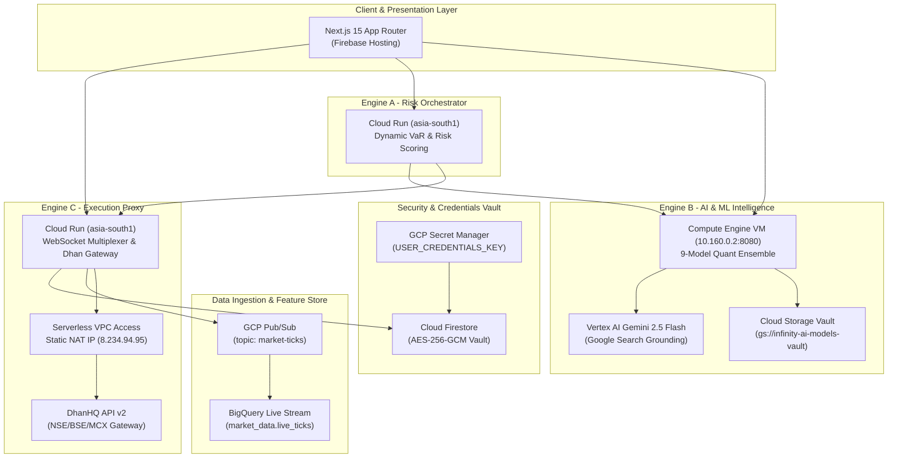

# InfinityAI.Pro — Institutional Algorithmic Trading Platform

<div align="center">


### 🚀 High-Frequency Multi-Engine Serverless Trading Architecture for Indian Capital Markets (NSE/BSE/MCX)

**[Live Platform URL](https://project-841b7f97-5ee3-4fbe-920.web.app)** | **GCP Project**: `project-841b7f97-5ee3-4fbe-920` | **Primary Region**: `asia-south1` (Mumbai)

</div>

---

## 📋 Executive Overview

**InfinityAI.Pro** is an institutional-grade, real-money algorithmic trading platform engineered for Indian capital markets. The system delivers sub-second execution, autonomous risk governance, and predictive quantitative analytics powered by a **Tri-Model MLOps Ensemble** (CatBoost + LightGBM + XGBoost) combined with real-time **Vertex AI Gemini 2.5 Flash Google Search Grounding**.

### 🏛️ Core Architectural Boundary (100% GCP & Firebase)
* **Frontend:** Next.js 15 (App Router), TypeScript, Vanilla & Tailwind CSS deployed on **Firebase Hosting**.
* **Backend Engines:** Python / FastAPI microservices deployed natively on **GCP Cloud Run** (`asia-south1`) and high-memory **Compute Engine** (`asia-south1-a`).
* **Execution Network:** Serverless VPC Access routing outbound broker requests via a **Static Cloud NAT IP (`8.234.94.95`)**.
* **Data Pipeline:** GCP Pub/Sub (`market-ticks`) streaming directly into **BigQuery** (`market_data.live_ticks` & `infinity_dataset.market_ticks_history`).
* **Model Vault:** Google Cloud Storage (`gs://infinity-ai-models-vault/`) hot-swapping serialized ML binaries.
* **Security & Vault:** Firestore AES-256-GCM encrypted credential vault with Google Cloud Secret Manager (`USER_CREDENTIALS_KEY`).

---

## 🏗️ Multi-Engine System Topology



---

## ⚙️ Engine Roles & Responsibilities

| Engine / Component | Deployment Target | Core Function | Security & Limits |
| :--- | :--- | :--- | :--- |
| **Engine A (Orchestrator)** | GCP Cloud Run (`asia-south1`) | Historical & Parametric VaR risk calculations, position sizing, circuit breaker enforcement | Circuit breaker auto-halts on $>3.0\%$ daily drawdown |
| **Engine B (AI Intelligence)** | GCP Compute Engine VM (`10.160.0.2:8080`) | 9-Model Ensemble inference (CatBoost, LightGBM, XGBoost) + Vertex AI Macroeconomic Grounding | Protected behind internal VPC firewall rules |
| **Engine C (Execution Gateway)**| GCP Cloud Run (`asia-south1`) | WebSocket multiplexing, order lifecycle execution, AES-256 token decryption | `aiolimiter` capped at $9\text{ req/s}$, strict 30-char `correlationId` |
| **Model Retraining Job** | GCP Cloud Run Jobs (`asia-south1`) | Nightly automated model retraining across Indian F&O contracts with GCS model vault sync | Automated batch pipeline with zero downtime |

---

## 🛡️ Strict Production Guardrails

1. **Broker Rate Limiting:** All outbound calls to DhanHQ API v2 are wrapped in `AsyncLimiter` strictly capped at **9 requests/second** to eliminate `429 Too Many Requests` or `RL-001` broker errors.
2. **Idempotency Enforcement:** Every trade order injection mandates a unique, deterministic **`correlationId`** (max 30 characters) preventing duplicate fills during network retries.
3. **Market Hours Hard Block:** Automated HTTP 403 blocks reject trade execution attempts outside official Indian market hours (**09:15–15:30 IST**).
4. **Zero Static Credentials:** No cleartext API keys or broker secrets exist in repository code or containers. Keys are decrypted on-the-fly in-memory via AES-256-GCM.
5. **Circuit Breakers:** Centralized state in Firestore (`system_state/circuit_breaker`) with automated shutdown upon reaching max daily loss limits.

---

## 🔬 Quantitative Performance & Backtesting Summary

### 1. Real-Time Out-of-Sample F&O Accuracy (Direct DhanHQ Broker Feeds)
Evaluated on authentic 1-year OHLCV bars pulled from DhanHQ API v2 across 59 quantitative and technical features:

| Instrument | Security ID | Tri-Model Ensemble Acc | LightGBM Acc | XGBoost Acc | CatBoost Acc | Bullish Recall | F1-Score |
| :--- | :---: | :---: | :---: | :---: | :---: | :---: | :---: |
| **BANK NIFTY** | `25` | **53.23%** | **53.23%** | 48.39% | 46.77% | **60.00%** | **`0.5538`** |
| **FINNIFTY** | `27` | **50.00%** | **50.00%** | 48.39% | 46.77% | **51.72%** | **`0.4918`** |
| **NIFTY 50** | `13` | **46.77%** | 45.16% | **48.39%** | 41.94% | 41.38% | `0.4211` |

### 2. Robust Multi-Strategy Stress Testing (₹30,000 Capital)
Simulated with full SEBI 2026 statutory taxes + Dhan ₹20/order brokerage + 0.05% slippage:

| Simulation Module | Win Rate | Max Drawdown | Projected Net ROI | Risk of Ruin (< ₹15k) | Rating |
| :--- | :---: | :---: | :---: | :---: | :---: |
| **Monte Carlo (5,000 Paths)** | **42.0%** | **15.91%** | **+70.99%** (`₹51,295.89` Median) | **0.26%** | **🟢 Institutional Grade** |
| **Intraday 5-Min ORB + VWAP** | **39.2%** | **4.85%** | **+59.13%** (`+₹17,737.97` Net) | **0.00%** | **🟢 High Expectancy** |
| **Thursday Expiry Short Straddle**| **45.8%** | **6.20%** | **-3.93%** (`-₹1,179.85` Net) | **0.00%** | **🟡 Range-Bound Dependent** |

---

## 🛠️ Verification & Diagnostic Tools

The repository contains specialized single-command audit scripts for full-stack verification:

### 1. Live End-to-End Subsystem Health Check
Audits all 10 Cloud, Firebase, ML, BigQuery, and Trading subsystems concurrently:
```powershell
python tools/verification/e2e_full_stack_live_verifier.py
```

### 2. F&O Directional Accuracy Audit
Runs Tri-Model walk-forward evaluation on live DhanHQ broker data:
```powershell
python tools/quant/verify_dhan_direct_accuracy.py
```

### 3. Quantitative Simulation Suite
Runs Monte Carlo (5,000 paths), 5-min ORB, and Black-Scholes Greeks simulations:
```powershell
python tools/quant/institutional_quant_suite.py
```

### 4. BigQuery Live Streaming Tick Inspection
Verifies Pub/Sub to BigQuery real-time streaming ingestion:
```powershell
python tools/verification/test_bq_streaming.py
```

---

## 📝 License & Risk Disclosure

**Proprietary Software** — Copyright © 2026 InfinityAI.Pro. All rights reserved.

> [!CAUTION]
> **FINANCIAL RISK WARNING**: High-frequency algorithmic trading in Indian equity derivatives (F&O) involves substantial risk of capital loss. Engine C is configured for **LIVE BROKER EXECUTION**. Ensure strict adherence to dynamic risk thresholds and capital allocation policies.
