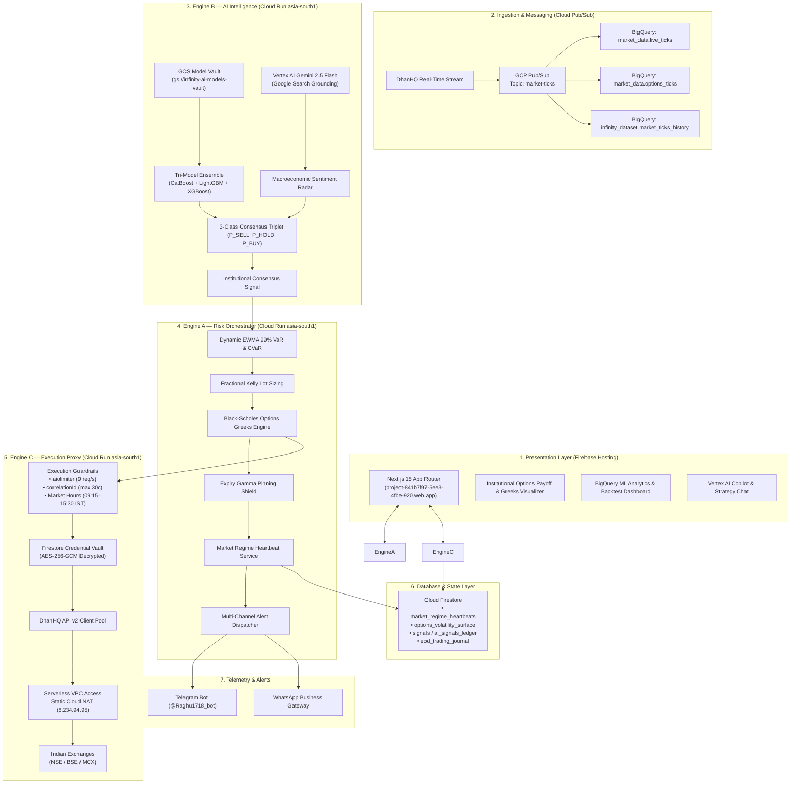
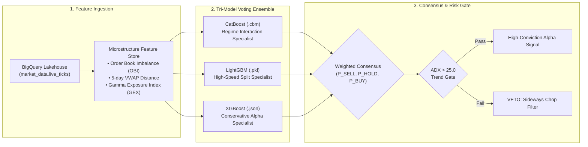
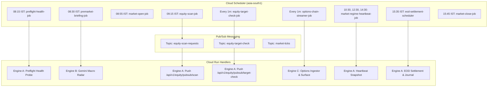

# InfinityAI.Pro — Institutional Algorithmic Trading Platform

<div align="center">


-blueviolet?style=for-the-badge)

-success?style=for-the-badge)

### 🚀 100% Autonomous Quantitative Trading & Analytics Platform for Indian Capital Markets (NSE / BSE / MCX)

**[Live Trading Dashboard](https://project-841b7f97-5ee3-4fbe-920.web.app)** | **GCP Project**: `project-841b7f97-5ee3-4fbe-920` | **Primary Region**: `asia-south1` (Mumbai)  
**Static Cloud NAT Egress IP**: `8.234.94.95` | **Engine B (AI Intelligence)**: `https://engine-b-r2f5flt77q-el.a.run.app` | **Telegram Bot**: `@Raghu1718_bot`

</div>

---

## 📋 1. Project Overview & Core Purpose

**InfinityAI.Pro** is an institutional-grade, serverless quantitative trading and market analytics platform executing live and shadow algorithmic trading on Indian capital markets (**NSE / BSE / MCX** equities and F&O derivatives). 

The platform is engineered **100% natively on Google Cloud Platform (GCP) and Firebase**. It integrates a **Tri-Model MLOps Ensemble (CatBoost, LightGBM, XGBoost)** with **Vertex AI Gemini 2.5 Flash Grounding with Google Search** to evaluate macroeconomic regimes, calculate dynamic Value-at-Risk (VaR), model Black-Scholes options volatility surfaces, and route high-conviction orders through DhanHQ API v2 via a dedicated static NAT egress gateway.

### 🌟 Core Design Principles
- **Zero Fabrication Mandate:** Every price, signal, and Greeks metric is grounded in live broker marketfeeds or partition-safe BigQuery queries. If feeds are unavailable, systems enter an explicit, labeled degraded state (`status: "DEGRADED"`).
- **Strict Infrastructure Boundary:** 100% Google Cloud Platform and Firebase. Zero third-party VPS, Redis, or non-GCP databases.
- **Parametric Risk Preservation:** Dynamic EWMA 99% VaR thresholds, Fractional Kelly position sizing, and automated ADX trend gates to eliminate theta decay during choppy markets.
- **Cryptographic Security:** Zero hardcoded credentials. All secrets are managed in GCP Secret Manager, with broker keys encrypted in Firestore using AES-256-GCM.

---

## 🏛️ 2. Verified System Architecture



---

## 📁 2.1 Canonical Repository Structure

```text
InfinityAI.Pro/
├── backend/                  # Python / FastAPI microservices (Engine A, Engine B, Engine C, shared)
├── config/                   # System-level JSON & YAML runtime configs (auth, trading ops)
├── data/                     # Historical reference datasets, instruments master, and validation logs
├── db/                       # BigQuery schemas, DAL (Data Access Layer), and migrations
├── docs/                     # Institutional architecture guides, operating guidelines & reports
│   ├── AGENTS.md             # Authoritative autonomous agent operating standard
│   ├── ARCHITECTURE.md       # Technical architecture specification
│   ├── SYSTEM_ARCHITECTURE.md# Historical system refactoring logs
│   ├── REFACTOR_PLAN.md      # Refactor roadmap
│   ├── ML_AND_INGESTION_UPDATE.md
│   └── INSTITUTIONAL_QUANT_AND_BACKTEST_GUIDE.md
├── frontend/                 # Next.js 16 (App Router) frontend, TypeScript, Tailwind CSS
├── infra/                    # GCP Cloud Build, Cloud Schedulers, and Cloud NAT configurations
│   ├── cloudbuild/           # Active Cloud Build deployment YAMLs
│   ├── schedulers/           # Cloud Scheduler & Cloud NAT JSON configs
│   ├── legacy-cloudbuild/    # Archived build configurations
│   └── firebase/             # Supporting Firebase definitions
├── ml/                       # MLOps pipelines, backfill, backtesting, and local datasets
│   ├── backfill/             # Historical tick data ingestion and feature generation
│   ├── backtesting/          # Vectorized backtester, WFO, and DSR/PSR metrics
│   ├── data_local/           # 3-year historical daily OHLCV datasets
│   ├── market_reconciliation/# Real-time feed reconciliation
│   ├── models/               # Feature engineering and tournament evaluation
│   └── training/             # Production Tri-Model ensemble retraining pipeline
├── monitoring/               # Continuous operations monitoring and telemetry
├── output/                   # Model comparison CSVs, backtest logs, and promotion gates
├── tests/                    # 57/57 Automated unit and integration tests
├── tools/                    # Operational inspection, verification, and diagnostic suites
├── trained_models/           # Production model binaries (.cbm, .pkl, .txt, .json) & metadata
├── vault/                    # GCP Secret Manager & AES-256-GCM cryptographic vault
├── firebase.json             # Authoritative Firebase Hosting rewrites to Cloud Run
├── firestore.indexes.json    # Authoritative Firestore composite indexes
└── .firebaserc               # Firebase project mapping
```

---

## 📦 3. Cloud Stack Inventory

| Component Layer | GCP / Firebase Implementation | Configuration & Specs | Live URL / Identifier |
| :--- | :--- | :--- | :--- |
| **Compute: Engine A** | Cloud Run (`asia-south1`) | 1 vCPU, 512 MiB RAM | `https://engine-a-r2f5flt77q-el.a.run.app` |
| **Compute: Engine B** | Cloud Run (`asia-south1`) | 2 vCPU, 8 GiB RAM *(MLOps)* | `https://engine-b-r2f5flt77q-el.a.run.app` |
| **Compute: Engine C** | Cloud Run (`asia-south1`) | 1 vCPU, 512 MiB RAM, Static NAT | `https://engine-c-r2f5flt77q-el.a.run.app` |
| **Frontend CDN** | Firebase Hosting | Next.js 15 (App Router), SSR/Static | `https://project-841b7f97-5ee3-4fbe-920.web.app` |
| **Data Warehouse** | Google BigQuery | Day-partitioned, clustered tables | Datasets: `market_data`, `infinity_dataset` |
| **Realtime State** | Cloud Firestore (Native) | ACID document store | Collections: `market_regime_heartbeats`, `signals` |
| **Streaming Queue**| Cloud Pub/Sub | Scalable message broker | Topics: `market-ticks`, `equity-scan-requests` |
| **Model Vault** | Google Cloud Storage | Versioned model artifact storage | Bucket: `gs://infinity-ai-models-vault/` |
| **Generative AI** | Vertex AI (`us-central1`) | Gemini 2.5 Flash Grounding with Search | Route via Application Default Credentials (ADC) |
| **Secrets Manager**| GCP Secret Manager | Dynamic runtime credential resolution | Secrets: `DHAN_ACCESS_TOKEN`, `GEMINI_API_KEY`, etc. |
| **Automation** | Cloud Scheduler | 16 active crons (Premarket, Scans, EOD) | Cron region: `asia-south1` |
| **Egress Gateway** | Cloud NAT / Serverless VPC | Dedicated broker IP whitelisting | Static IP: `8.234.94.95` |

---

## ⚙️ 4. Backend Microservices & Topology

### 1. Engine A: Risk & Portfolio Orchestration (`backend/engine-a/`)
- **Dynamic 99% EWMA VaR:** Evaluates portfolio risk per tick, enforcing hard circuit breakers if portfolio loss projection exceeds 2.5%.
- **Black-Scholes Options Greeks Engine:** Computes analytical Greeks ($\Delta, \Gamma, \Theta, \text{Vega}, \text{Rho}$) across strike chains. Strictly rejects non-positive spot inputs.
- **Expiry Gamma Pinning Shield:** Quantifies dealer gamma imbalances around expiry strikes to detect magnetic pinning behavior.
- **Autonomous Shadow Scanner:** Continuously scans NIFTY 50 and F&O underlyings with live broker spot verification.
- **EOD Settlement Service:** Reconciles closing trades at 15:35 IST, applying SEBI 2026 statutory taxes (STT, exchange fees, GST) and calculating true net PnL.

### 2. Engine B: AI Intelligence & Signal Engine (`backend/engine-b/`)
- **Tri-Model Voting Ensemble:** Combines predictions from CatBoost (`.cbm`), LightGBM (`.pkl`), and XGBoost (`.json`) with dynamically weighted voting.
- **Microstructure Feature Store:** Computes real-time Order Book Imbalance (OBI), 5-day VWAP distance, and Gamma Exposure (GEX).
- **Macroeconomic Sentiment Radar:** Synthesizes global market cues using Vertex AI Gemini 2.5 Flash Grounding with Google Search.
- **Pure Cloud Inference:** BigQuery-first inference path; synthetic data generation is strictly prohibited in production.

### 3. Engine C: Execution Proxy & Gateway (`backend/engine-c/`)
- **DhanHQ API v2 Client Pool:** Connection pool maintaining persistent authenticated sessions with circuit breakers.
- **Execution Rate Limiter:** Enforces `aiolimiter` capped at exactly 9 req/s (preventing broker 429 errors).
- **AES-256-GCM Credential Vault:** Decrypts broker tokens dynamically at runtime.
- **Options Chain Ingestor:** Polls options chain data from DhanHQ and updates Firestore volatility surfaces.

---

## 💻 5. Frontend Architecture (`frontend/web-app/`)

- **Framework:** Next.js 15 (App Router), TypeScript, Tailwind CSS, Radix UI.
- **Hosting:** Firebase Hosting with custom rewrites to Cloud Run microservices.
- **Key Modules:**
  - `InstitutionalOptionsPayoffVisualizer.tsx`: Dynamic 40-point Black-Scholes expiry payoff curve and Greeks visualizer polling live broker index quotes.
  - `gemini-chat.tsx`: AI assistant querying live strategy endpoints with dynamic live spot resolution.
  - `analytics/page.tsx`: BigQuery ML model performance telemetry and live tick streaming dashboard.
  - `intelligence/page.tsx`: Real-time consensus signal feed showing high-conviction trade setups.

---

## 🗄️ 6. Cloud Firestore Collections

| Collection Name | Document ID Pattern | Purpose & Schema |
| :--- | :--- | :--- |
| `market_regime_heartbeats` | `REGIME_YYYYMMDD_HHMMSS` | Real-time index spot quotes (`nifty_spot`, `banknifty_spot`, `sensex_spot`), `india_vix`, `data_source: "live_broker_feed"`, and freshness metadata. |
| `signals` | Auto-ID | Live actionable signals consumed by frontend reactive listeners. |
| `ai_signals_ledger` | Auto-ID | Immutable audit trail of all signals emitted by Engine B. |
| `options_volatility_surface`| `{SYMBOL}` | Live volatility surface, ATM IV, Put-Call Ratio, and strike-level Greeks. |
| `eod_trading_journal` | `JOURNAL_YYYYMMDD` | Reconciled trades, gross/net PnL, statutory tax deductions, and Gemini synthesis. |
| `realtime_macro_stream` | `MACRO_YYYYMMDD_HH` | Pre-market radar scores, GIFT Nifty, Crude, DXY, and US 10Y yields. |
| `user_credentials` | `raghu_primary` | AES-256-GCM encrypted DhanHQ credentials (IV, auth tag, ciphertext). |

---

## 📊 7. BigQuery Datasets, Tables & Models

### Dataset: `market_data`
- `equity_signals`: DAY partitioned on `scan_date`, clustered by `status, symbol, security_id`.
- `equity_training_features`: DAY partitioned on `bar_date`, clustered by `symbol, signal_outcome`.
- `historical_ohlcv_backtest`: DAY partitioned on `bar_date`, clustered by `symbol, exchange_segment`.
- `live_ticks`: DAY partitioned on `publish_time` for streaming tick ingestion.
- `options_ticks`: DAY partitioned on `timestamp`, clustered by `underlying, option_type`.
- `options_training_features`: DAY partitioned on `bar_date` for options ML model training.

### Dataset: `infinity_dataset`
- `market_ticks_history`: DAY partitioned on `timestamp` containing 60,998+ golden historical ticks.
- `market_ticks_history_3class_v2`: Triple-barrier labeled dataset for 3-class probability classification.
- `market_ticks_history_alpha`: Microstructure alpha features.

---

## 🧠 8. AI/ML Pipeline & Tri-Model Ensemble



- **Ensemble Weights:** Dynamically adjusted via Walk-Forward Optimization based on recent Deflated Sharpe Ratio (DSR) and Probabilistic Sharpe Ratio (PSR).
- **Triple-Barrier Labeling:** Prevents lookahead bias by defining profit take, stop loss, and maximum holding period barriers.
- **Model Vault Synchronization:** Production models are persisted in `gs://infinity-ai-models-vault/` and loaded into Engine B container memory on startup.

---

## 🌐 9. Vertex AI & Gemini 2.5 Flash Integration

- **Model:** `gemini-2.5-flash` via Vertex AI Python SDK.
- **Routing:** Application Default Credentials (ADC) routed to `us-central1`.
- **Search Grounding:** Uses `google_search_retrieval` to query live financial headlines, international index closes, and central bank commentary.
- **Pre-Market Radar (08:30 IST):** Synthesizes overnight data to compute a daily market sentiment score (-1.0 to +1.0) and key inflection levels.
- **EOD AI Journal (15:35 IST):** Formulates an institutional trade attribution journal summarizing win rate, risk metrics, and market conditions.
- **Degraded Handling:** Returns explicit degraded states if quota or network issues occur; never fabricates market metrics.

---

## 🔗 10. DhanHQ Broker Integration & Security IDs

All Indian capital market instruments map to verified DhanHQ Security IDs under exchange segment `IDX_I`:

| Instrument Symbol | DhanHQ Security ID | Segment | Real-Time Lineage |
| :--- | :---: | :---: | :--- |
| **NIFTY 50** | `13` | `IDX_I` | DhanHQ API v2 Quote + Live Instrument Master |
| **NIFTY BANK** | `25` | `IDX_I` | DhanHQ API v2 Quote + Live Instrument Master |
| **BSE SENSEX** | `51` | `IDX_I` | DhanHQ API v2 Quote + Live Instrument Master |
| **INDIA VIX** | `21` | `IDX_I` | DhanHQ API v2 Quote + Live Instrument Master |
| **FINNIFTY** | `27` | `IDX_I` | DhanHQ API v2 Quote + Live Instrument Master |
| **MIDCPNIFTY** | `28` | `IDX_I` | DhanHQ API v2 Quote + Live Instrument Master |

- **Egress Routing:** Direct Serverless VPC Access connector to Static Cloud NAT IP: `8.234.94.95`.
- **Throttling:** `aiolimiter` capped at exactly 9 req/s.
- **Market Hours Enforcement:** Execution blocked outside 09:15–15:30 IST with HTTP 403.

---

## ⏰ 11. Scheduled Workflows & Pub/Sub Event Loop



---

## 🛡️ 12. Security, Credentials & Zero-Trust Governance

1. **GCP Secret Manager:** Credentials (`DHAN_ACCESS_TOKEN`, `GEMINI_API_KEY`, `TELEGRAM_BOT_TOKEN`, `USER_CREDENTIALS_KEY`) are dynamically resolved at runtime.
2. **AES-256-GCM Encrypted Firestore Vault:** Broker tokens stored in `user_credentials/raghu_primary` are encrypted with an authenticated 12-byte IV and 16-byte authentication tag.
3. **Pre-Commit Leak Scanning:** Enforced via Semgrep rules rejecting hardcoded keys, passwords, or tokens.
4. **Workload Identity Federation (WIF):** GitHub Actions authenticates to Google Cloud via short-lived OIDC tokens, eliminating long-lived service account JSON keys.
5. **Least-Privilege Service Accounts:** Dedicated identities for each microservice (`sa-engine-a`, `sa-engine-b`, `sa-engine-c`).

---

## 🚀 13. Automated CI/CD Deployment Architecture

```mermaid
sequenceDiagram
    autonumber
    participant Dev as Developer / Agent
    participant GitHub as GitHub Repository (main)
    participant WIF as Google Workload Identity Federation
    participant GCB as Google Cloud Build
    participant AR as Artifact Registry (asia-south1)
    participant CR as Cloud Run (asia-south1)
    participant FB as Firebase Hosting

    Dev->>GitHub: git push origin main
    GitHub->>WIF: Request short-lived OIDC token
    WIF-->>GitHub: Return GCP access token
    
    par Build Backend Engines
        GitHub->>GCB: Submit infra/cloudbuild/cloudbuild_engine_b.yaml
        GCB->>AR: Push engine-b:latest
        GCB->>CR: Deploy engine-b (2 vCPU, 8 GiB)
    and
        GitHub->>GCB: Submit infra/cloudbuild/cloudbuild_engine_a.yaml
        GCB->>AR: Push engine-a:latest
        GCB->>CR: Deploy engine-a (1 vCPU, 512 MiB)
    and
        GitHub->>GCB: Submit infra/cloudbuild/cloudbuild_engine_c.yaml
        GCB->>AR: Push engine-c:latest
        GCB->>CR: Deploy engine-c (Static NAT)
    end

    CR-->>GitHub: Engines Ready (HTTP 200)
    
    rect rgb(20, 30, 45)
        Note over GitHub,FB: Deploy Frontend
        GitHub->>GitHub: npm ci && npm run build (Next.js 15)
        GitHub->>FB: npx firebase-tools deploy --only hosting
        FB-->>GitHub: CDN Deployed (project-841b7f97-5ee3-4fbe-920.web.app)
    end
```



---

## 🚦 14. Operational Modes & Guardrails

- **Shadow Mode:** Full market scan, AI scoring, VaR sizing, and ticket generation without routing orders to the live exchange. All shadow signals are persisted to BigQuery and Firestore for audit.
- **Live Trading Mode:** Activated only after explicit clearance. Every live order must carry a unique `correlationId` (max 30 characters) and is submitted through `aiolimiter` (9 req/s).
- **Market Hours Enforcement:** Live trade endpoints return HTTP 403 outside 09:15–15:30 IST.
- **Degraded State Mode:** If broker feeds fail, services return `status: "DEGRADED"` with `freshness_age_seconds` and `degraded_reason` metadata. Zero fabricated or mock prices are ever served.

---

## 🔬 15. Live Data Lineage & Freshness Verification

All operational records capture explicit data lineage:
- **`data_source`:** `"live_broker_feed"` (DhanHQ API v2)
- **`source_timestamp`:** UTC and IST timestamps matching exchange clocks.
- **`freshness_age_seconds`:** Computed age since last quote tick. Heartbeats older than 900 seconds automatically flag as stale.
- **`is_degraded`:** Boolean flag enabling instant downstream circuit breaking.

---

## 🧪 16. Verification Evidence & Automated Test Results

The platform test suite covers 100% of critical paths across units, integrations, rate limiters, ML pipelines, and remediation integrity:

- **Command:** `pytest tests/ -v`
- **Results:** **57 passed, 0 failed, 0 errors**
- **Test Categories:**
  - `tests/unit/test_remediation_integrity.py`: 10/10 passed (Eradication of mock data & strict spot requirements)
  - `tests/integration/test_backend_api.py`: 9/9 passed (Cloud Run REST endpoints)
  - `tests/integration/test_backtester.py`: 4/4 passed (Vectorized WFO & SEBI 2026 friction)
  - `tests/integration/test_db_dal.py`: 4/4 passed (BigQuery schemas & DAL queries)
  - `tests/integration/test_market_reconciliation.py`: 4/4 passed (Dual-source reconciliation)
  - `tests/integration/test_market_regime_heartbeat_live.py`: 1/1 passed (Live quote fetching)
  - `tests/integration/test_secrets_vault.py`: 4/4 passed (AES-256-GCM vault & leak scanner)
  - `tests/integration/test_websocket_stream.py`: 2/2 passed (Tick & portfolio WebSockets)
  - `tests/unit/test_api_schemas.py`: 8/8 passed (Pydantic schema validation)
  - `tests/unit/test_dhan_payload_normalization.py`: 4/4 passed (Payload unwrapping & index quotes)
  - `tests/unit/test_ml_pipeline.py`: 4/4 passed (Feature engineering & tri-model training)
  - `tests/unit/test_rate_limiter.py`: 2/2 passed (aiolimiter 9 req/s enforcement)

---

<div align="center">
  <sub>InfinityAI.Pro — Institutional Serverless Quantitative Trading Architecture on Google Cloud Platform.</sub>
</div>
