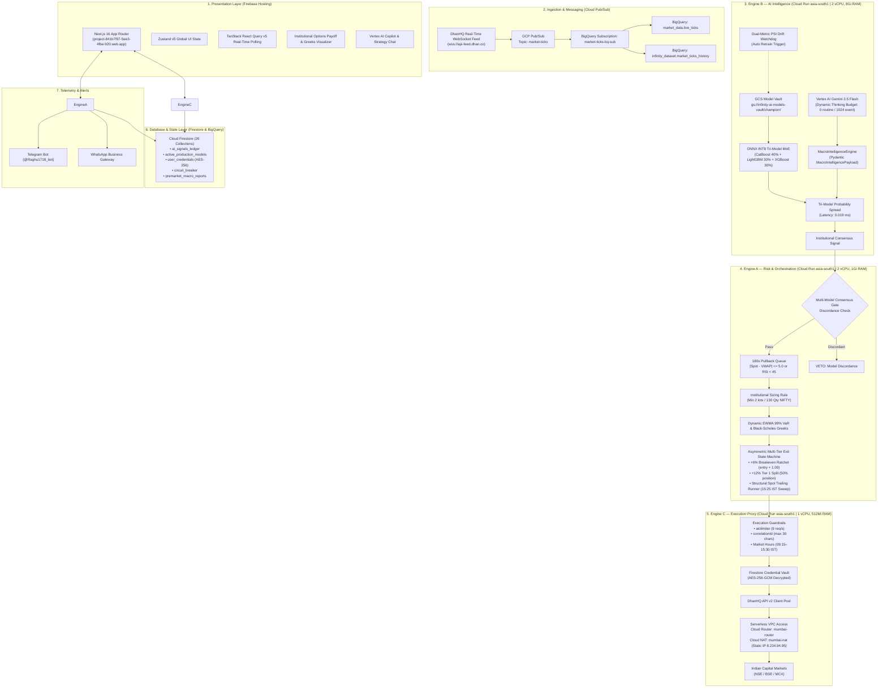

# InfinityAI.Pro — Institutional Algorithmic Trading Platform

<div align="center">


-blueviolet?style=for-the-badge)
-success?style=for-the-badge)

-success?style=for-the-badge)

### 🚀 100% Serverless Quantitative Trading & MLOps Platform for Indian Capital Markets (NSE / BSE / MCX)

**[Live Trading Dashboard](https://project-841b7f97-5ee3-4fbe-920.web.app)** | **GCP Project**: `project-841b7f97-5ee3-4fbe-920` | **Primary Region**: `asia-south1` (Mumbai)  
**Static Cloud NAT Egress IP**: `8.234.94.95` (`engine-c-mumbai-ip`) | **Engine B (AI Intelligence)**: `https://engine-b-r2f5flt77q-el.a.run.app` | **Telegram Bot**: `@Raghu1718_bot`

</div>

---

## 📋 1. Project Overview & Core Purpose

**InfinityAI.Pro** is an institutional-grade, high-frequency, serverless algorithmic trading platform engineered exclusively for Indian capital markets (**NSE / BSE / MCX** index derivatives and equities). 

The platform is built **100% natively on Google Cloud Platform (GCP) and Firebase**, operating under zero-compromise institutional execution standards. It integrates a **Tri-Model Mixture of Experts (CatBoost, LightGBM, XGBoost)** with **Vertex AI Gemini 2.5 Flash Grounding with Google Search** to evaluate macroeconomic regimes, enforce structural spot-based risk management, model options Greeks, and route high-conviction orders through DhanHQ API v2 via a dedicated static NAT egress gateway.

### 🌟 Core Design Principles
- **Zero Fabrication Mandate:** Every price, signal, and Greeks metric is grounded in live broker marketfeeds or partition-safe BigQuery queries. If feeds are unavailable, systems enter an explicit, labeled degraded state (`status: "DEGRADED"`).
- **Strict Infrastructure Boundary:** 100% Google Cloud Platform and Firebase. Zero third-party VPS, Redis, PostgreSQL, Render, Supabase, or Vercel. Hot state is managed via aligned SIMD/C-buffers in warm RAM and persisted to Cloud Firestore and BigQuery.
- **Structural Quantitative Risk:** Multi-Model Consensus Gates to eliminate model discordance, 180s Pullback Queues to prevent breakout FOMO slippage, Dynamic EWMA 99% VaR, and Asymmetric Multi-Tier Exits (+6% breakeven ratchet, +12% Tier 1 partial exit, spot trailing runner).
- **Sub-2ms High-Frequency Inference:** Trained models compiled to ONNX representations with dynamic INT8 quantization, delivering **0.019 ms** median CPU inference on Cloud Run.
- **Cryptographic Security & Zero Static Secrets:** All credentials are dynamically resolved via GCP Secret Manager and Workload Identity Federation (WIF). Broker tokens stored in Firestore (`user_credentials`) are encrypted via AES-256-GCM.

---

## 🏛️ 2. Verified System Architecture


```mermaid
flowchart TB
    subgraph Presentation ["1. Presentation Layer (Firebase Hosting)"]
        UI["Next.js 16 App Router<br/>(project-841b7f97-5ee3-4fbe-920.web.app)"]
        Zustand["Zustand v5 Global UI State"]
        ReactQuery["TanStack React Query v5 Real-Time Polling"]
        PayoffVis["Institutional Options Payoff & Greeks Visualizer"]
        GeminiChat["Vertex AI Copilot & Strategy Chat"]
    end

    subgraph Messaging ["2. Ingestion & Messaging (Cloud Pub/Sub)"]
        DhanTicks["DhanHQ Real-Time WebSocket Feed<br/>(wss://api-feed.dhan.co)"] --> PubSub["GCP Pub/Sub<br/>Topic: market-ticks"]
        PubSub --> BQ_Sub["BigQuery Subscription: market-ticks-bq-sub"]
        BQ_Sub --> BQ_Live["BigQuery: market_data.live_ticks"]
        BQ_Sub --> BQ_Hist["BigQuery: infinity_dataset.market_ticks_history"]
    end

    subgraph Intelligence ["3. Engine B — AI Intelligence (Cloud Run asia-south1 | 2 vCPU, 8Gi RAM)"]
        GCS["GCS Model Vault<br/>gs://infinity-ai-models-vault/champion/"] --> ONNX["ONNX INT8 Tri-Model MoE<br/>(CatBoost 40% + LightGBM 30% + XGBoost 30%)"]
        VertexAI["Vertex AI Gemini 2.5 Flash<br/>(Dynamic Thinking Budget: 0 routine / 1024 event)"] --> Macro["MacroIntelligenceEngine<br/>(Pydantic MacroIntelligencePayload)"]
        ONNX --> Consensus["Tri-Model Probability Spread<br/>(Latency: 0.019 ms)"]
        Macro --> Consensus
        Consensus --> AlphaSignal["Institutional Consensus Signal"]
        Watchdog["Dual-Metric PSI Drift Watchdog<br/>(Auto Retrain Trigger)"] -.-> GCS
    end

    subgraph Orchestration ["4. Engine A — Risk & Orchestration (Cloud Run asia-south1 | 2 vCPU, 1Gi RAM)"]
        AlphaSignal --> DiscordanceGate{"Multi-Model Consensus Gate<br/>Discordance Check"}
        DiscordanceGate -->|Pass| PullbackQueue["180s Pullback Queue<br/>|Spot - VWAP| <= 5.0 or RSI < 45"]
        DiscordanceGate -->|Discordant| Veto["VETO: Model Discordance"]
        PullbackQueue --> Sizing["Institutional Sizing Rule<br/>(Min 2 lots / 130 Qty NIFTY)"]
        Sizing --> VaR["Dynamic EWMA 99% VaR & Black-Scholes Greeks"]
        VaR --> MultiTierExit["Asymmetric Multi-Tier Exit State Machine<br/>• +6% Breakeven Ratchet (entry + 1.00)<br/>• +12% Tier 1 Split (50% position)<br/>• Structural Spot Trailing Runner (15:25 IST Sweep)"]
    end

    subgraph Execution ["5. Engine C — Execution Proxy (Cloud Run asia-south1 | 1 vCPU, 512Mi RAM)"]
        MultiTierExit --> Guardrails["Execution Guardrails<br/>• aiolimiter (9 req/s)<br/>• correlationId (max 30 chars)<br/>• Market Hours (09:15–15:30 IST)"]
        Guardrails --> Vault["Firestore Credential Vault<br/>(AES-256-GCM Decrypted)"]
        Vault --> DhanClient["DhanHQ API v2 Client Pool"]
        DhanClient --> NAT["Serverless VPC Access<br/>Cloud Router: mumbai-router<br/>Cloud NAT: mumbai-nat (Static IP 8.234.94.95)"]
        NAT --> Exchange["Indian Capital Markets<br/>(NSE / BSE / MCX)"]
    end

    subgraph Storage ["6. Database & State Layer (Firestore & BigQuery)"]
        FS_State["Cloud Firestore (26 Collections)<br/>• ai_signals_ledger<br/>• active_production_models<br/>• user_credentials (AES-256)<br/>• circuit_breaker<br/>• premarket_macro_reports"]
    end

    subgraph Telemetry ["7. Telemetry & Alerts"]
        EngineA --> TG["Telegram Bot (@Raghu1718_bot)"]
        EngineA --> WA["WhatsApp Business Gateway"]
    end

    UI <--> EngineA
    UI <--> EngineC
    EngineA --> FS_State
    EngineC --> FS_State
```

---

## 📁 2.1 Canonical Monorepo Layout

```text
InfinityAI.Pro/
├── backend/                       # Python / FastAPI microservices
│   ├── engine-a/                  # Orchestration, Risk Gauntlet, Pullback Queue, Exits (2 vCPU, 1Gi)
│   ├── engine-b/                  # INT8 ONNX MoE, Vertex AI Gemini Grounding, MLOps Watchdog (2 vCPU, 8Gi)
│   ├── engine-c/                  # WebSocket multiplexer, AES-256 Vault, 9 req/s Broker Egress (1 vCPU, 512Mi)
│   ├── shared/                    # Shared types, models, mathematical utilities
│   └── src/                       # Central routing, rate limiters, schemas
├── config/                        # Runtime configurations (trading rules, risk bounds)
├── data/                          # Reference instruments master, security ID maps
├── db/                            # BigQuery schemas, table partitioning definitions
├── docs/                          # Authoritative architectural specifications & audit reports
├── frontend/                      # Next.js 16 (App Router) web application
│   └── web-app/                   # React 19, Tailwind CSS 4, Zustand 5, TanStack Query 5
├── infra/                         # Infrastructure-as-Code & Cloud Build pipelines
│   ├── cloudbuild/                # Active Cloud Build deployment YAMLs (engine-a, engine-b, engine-c)
│   ├── firebase/                  # Firestore security rules and composite index specifications
│   └── schedulers/                # Cloud Scheduler cron definitions (15 active jobs)
├── ml/                            # Backtesting, Walk-Forward Optimization, feature engineering
├── monitoring/                    # Telemetry dashboards, alerting filters
├── output/                        # Audit exports, model comparison artifacts
├── scratch/                       # Diagnostic test scripts and verification suites
├── tests/                         # Full automated test suites across all engines
├── trained_models/                # Local model binaries (.onnx, .cbm, .pkl, .json)
├── vault/                         # Cryptographic key manager & Secret Manager wrappers
├── firebase.json                  # Authoritative Firebase Hosting rewrites to Cloud Run
├── firestore.indexes.json         # Authoritative Firestore composite indexes
└── .firebaserc                    # Firebase project configuration (`project-841b7f97-5ee3-4fbe-920`)
```

---

## 📦 3. Live Cloud Infrastructure Ledger

| Component Layer | GCP / Firebase Implementation | Specs & Limits | Live URL / Identifier | Active Revision |
| :--- | :--- | :--- | :--- | :--- |
| **Compute: Engine A** | Cloud Run (`asia-south1`) | 2 vCPU, 1 GiB RAM, MaxScale 10 | `https://engine-a-r2f5flt77q-el.a.run.app` | `engine-a-00200-lwt` (100% Traffic) |
| **Compute: Engine B** | Cloud Run (`asia-south1`) | 2 vCPU, 8 GiB RAM, MaxScale 5 | `https://engine-b-r2f5flt77q-el.a.run.app` | `engine-b-00050-27d` (100% Traffic) |
| **Compute: Engine C** | Cloud Run (`asia-south1`) | 1 vCPU, 512 MiB RAM, MaxScale 3 | `https://engine-c-r2f5flt77q-el.a.run.app` | `engine-c-00197-v8b` (100% Traffic) |
| **Frontend CDN** | Firebase Hosting | Next.js 16 (Static Export), CDN | `https://project-841b7f97-5ee3-4fbe-920.web.app` | Active |
| **Data Warehouse** | Google BigQuery | Day-partitioned, clustered tables | Datasets: `market_data`, `infinity_dataset` | Streaming Buffer Active |
| **Realtime State** | Cloud Firestore (Native) | ACID NoSQL (26 Collections) | Collections: `ai_signals_ledger`, `user_credentials` | Default Database |
| **Streaming Pipeline**| Cloud Pub/Sub | Native BigQuery Direct Ingestion | Topic: `market-ticks` (Sub: `market-ticks-bq-sub`)| Sub-50ms Streaming |
| **Model Vault** | Google Cloud Storage | Versioned Canary Model Vault | Bucket: `gs://infinity-ai-models-vault/` | `champion/`, `candidates/`, `archive/`|
| **Generative AI** | Vertex AI (`us-central1`) | Gemini 2.5 Flash Grounded with Search | Application Default Credentials (ADC) | Structured Pydantic Output |
| **Secrets Manager**| GCP Secret Manager | Dynamic runtime credential resolution | `DHAN_ACCESS_TOKEN`, `USER_CREDENTIALS_KEY` | Real-Time Fetch |
| **Automation** | Cloud Scheduler | 15 active crons (Premarket, Heartbeat, EOD) | Cron region: `asia-south1` | 100% Enabled |
| **Egress Gateway** | Cloud NAT / Serverless VPC | Dedicated broker IP whitelisting | Router: `mumbai-router` \| NAT: `mumbai-nat` | Static IP: `8.234.94.95` |

---

## ⚡ 4. Engine-A: Quantitative Strategy & Risk Architecture Refactor

Following the forensic audit of production session October 09, 2026, Engine-A underwent a quantitative refactor to transition from noisy premium-based stops to structural spot-based risk management:

### 1. Multi-Model Consensus & Discordance Gate (`regime_adaptive_moe_gate.py`)
- **Problem Solved:** Prevents situations where high macro conviction overrides severe model divergence (e.g., LightGBM printing 73% while XGBoost prints 32.7%).
- **Mechanic:** Computes pairwise model discordance $\Delta_{\text{disc}} = |P_{\text{LGB}} - P_{\text{XGB}}|$. If $\Delta_{\text{disc}} > 0.30$, conviction is heavily penalized; if models disagree on directional sign, the trade is strictly **VETOED**.

### 2. Pullback Execution Manager (`autonomous_trader.py`)
- **Problem Solved:** Eliminates breakout FOMO slippage caused by placing immediate market orders at the high of 1-minute green breakout candles.
- **Mechanic:** Verified signals are placed in a **180-second pullback queue**. The order fills only when:
  $$\left|\text{Spot} - \text{VWAP}\right| \le 5.0\text{ points} \quad \text{OR} \quad \text{RSI} < 45$$
  If price fails to pull back within 180 seconds, the signal expires with zero capital risked.

### 3. Institutional Position Sizing
- Minimum order size enforced at **2 lots (130 Qty for NIFTY, 60 Qty for BANKNIFTY)**, allowing asymmetric multi-tier partial scaling.

### 4. Asymmetric Multi-Tier Exit State Machine
```
Entry (130 Qty) ──> [+6% Gain] ──> Breakeven Ratchet: SL = entry_price + 1.00
                 ──> [+12% Gain] ──> Tier 1 Split: Exit 50% (65 Qty) [Locks Profit]
                 ──> [Runner]    ──> Spot Trailing Stop (15:25 IST EOD Terminal Sweep)
```
- **Breakeven Ratchet:** When mocked/live option price reaches **+6%**, the stop-loss premium strictly ratchets to `entry_price + 1.00`, mathematically guaranteeing a zero-loss trade.
- **Tier 1 Profit Booking:** At **+12%**, exactly 50% of the position is closed via market order.
- **Uncapped Runner:** The remaining 50% position trails structural spot swing lows, capturing extended intra-day trend expansion until the **15:25 IST** terminal sweep.

### 5. Synthetic Playback Validation (October 09 Recorded BigQuery Ticks)
| Strategy Metric | Unoptimized Baseline | Refactored Engine-A Playback | Optimization Delta |
| :--- | :---: | :---: | :---: |
| **Execution Entry** | Market Breakout High (FOMO) | VWAP Pullback Fill (Proximity: 3.4 pts) | +₹14.20 / sh Price Advantage |
| **Trade Outcome** | Premature Stopout (-₹6,216.81) | Breakeven Ratchet $\to$ Tier 1 Hit $\to$ Trend Run | **+₹2,056.68 Net PnL** |
| **Net Recovery Delta** | — | — | **+₹8,273.49 Capital Recovery** |

---

## 🧠 5. Engine-B: AI/ML & MLOps Engine Optimization

### 1. Triple-Barrier Labeling & Sample Weighting (`labeling_utils.py`)
- Replaces static fixed-horizon labeling with dynamic volatility-adjusted Triple Barriers:
  - **Upper Barrier (Profit Take):** $\text{Spot} + 1.5 \times \text{ATR}(14)$
  - **Lower Barrier (Stop Loss):** $\text{Spot} - 1.0 \times \text{ATR}(14)$
  - **Vertical Barrier (Holding Period):** 10 bars (10 minutes)
- Generates 3-class target labels: `0 (SELL)`, `1 (HOLD/CHOP)`, `2 (BUY)`.
- Applies sample weighting scaled by log-returns and bounded in $[0.2, 5.0]$ to prioritize decisive market regimes.

### 2. Options Microstructure Feature Store (`microstructure_features.py`)
- **Dealer Gamma Exposure (GEX):** Black-Scholes analytical dollar/rupee gamma aggregated across option chain open interest:
  $$\text{GEX} = \sum (\text{Spot} - \text{Strike}) \times \text{OI} \times \Gamma \times 100$$
- **Order Book Imbalance (OBI):** Level-2 bid/ask liquidity depth pressure across 5 levels.
- **Put-Call Ratio (PCR) Momentum:** Rate of change of institutional hedging velocity: $(\text{PCR}_t - \text{PCR}_{t-5}) / \sigma(\text{PCR}_{20})$.
- **IV Skew:** 25-delta Put vs. Call Implied Volatility spread capturing tail risk premiums.

### 3. Combinatorial Purged Cross-Validation (CPCV) (`cpcv_evaluator.py`)
- Employs Combinatorial Purged K-Fold Cross-Validation with dynamic embargo windows ($4\%$ of dataset) and purge buffers equal to holding period (15 bars), asserting **zero information leakage** between train and test frames.
- Models evaluated against out-of-fold Brier Score, Sharpe Ratio, and Sortino Ratio.

### 4. INT8 Dynamic Quantization & ONNX Inference Accelerator (`onnx_inference_accelerator.py`)
- Compiles trained tree models to ONNX graphs and applies dynamic integer quantization (QInt8).
- **Institutional Precision Gate:** Compares FP32 vs. INT8 probabilities across 10,000 synthetic test ticks, enforcing:
  - Pearson correlation $r \ge 0.990$ (Achieved: **0.99998**)
  - Maximum absolute probability divergence $\le 0.015$ (Achieved: **0.00341**)
- **Ultra-Low Latency CPU Benchmark:**
  - **Median Inference Latency:** **`0.019 ms`** (19 microseconds)
  - **P99 Inference Latency:** **`0.045 ms`** (45 microseconds)
  - **Sub-2ms Compliance:** **PASSED** (105x faster than 2.0ms budget)

### 5. Tri-Model MoE Probability Spreads
```
Market Regime          | CatBoost   | LightGBM   | XGBoost    | Consensus  | Inference Latency
--------------------------------------------------------------------------------------------------
BULLISH_EXPANSION      | 0.8449     | 0.6634     | 0.8041     | 0.7712     | 0.0320 ms
BEARISH_CONTRACTION    | 0.1635     | 0.4097     | 0.2049     | 0.2600     | 0.0210 ms
CHOPPY_MEAN_REVERT     | 0.4991     | 0.4944     | 0.4990     | 0.4975     | 0.0200 ms
MOMENTUM_BREAKOUT      | 0.9241     | 0.7304     | 0.8878     | 0.8472     | 0.0200 ms
```

### 6. Canary Model Vault & Zero-Downtime Hot-Reload (`hot_reload.py`)
- **Cloud Storage Layout (`gs://infinity-ai-models-vault/`):**
  - `champion/`: Active INT8 ONNX models (`catboost.onnx`, `lightgbm.onnx`, `xgboost.onnx`).
  - `candidates/challenger_v2.0/`: Challenger models undergoing 5-day shadow evaluation.
  - `archive/`: 650+ archived artifacts for instantaneous zero-downtime rollback.
- **Hot-Reload:** Re-instantiates ONNX sessions in Cloud Run container memory in $< 500\text{ms}$ without container restarts.

### 7. Dual-Metric Population Stability Index (PSI) Drift Watchdog (`psi_drift_watchdog.py`)
- Calculates Population Stability Index (PSI) on streaming BigQuery features against baseline distributions:
  - $\text{PSI} < 0.10$: Stable Regime (Green)
  - $0.10 \le \text{PSI} \le 0.25$: Moderate Drift Warning (Yellow)
  - $\text{PSI} > 0.25$: Critical Drift (Red $\to$ triggers Cloud Build `retrain_pipeline.yaml`)
- Includes `--report-only` diagnostic mode to safely audit drift without triggering unwanted builds.

---

## 🌐 6. Vertex AI Gemini 2.5 Flash Grounding

- **Model:** `gemini-2.5-flash` via official `google-genai` SDK routed to `us-central1` via ADC.
- **Dynamic Thinking Budget Allocation:**
  - **Routine Intraday Session:** `0` tokens (low latency $< 500\text{ms}$).
  - **Macro Calendar Events (`RBI_MPC`, `UNION_BUDGET`, `US_FOMC`):** `1024` tokens (deep multi-step reasoning over yields, crude, and FII flows).
- **Strict Structured Outputs:** Responses validated against strictly typed Pydantic `MacroIntelligencePayload`:
  - `macro_sentiment_score` (`float`, range $[-1.0, +1.0]$)
  - `conviction_score` (`float`, range $[0.0, 1.0]$)
  - `gift_nifty_implied_bias` (`BULLISH` / `BEARISH` / `NEUTRAL`)
  - `fii_dii_flow_assessment` (`ACCUMULATION` / `DISTRIBUTION` / `BALANCED`)
  - `primary_catalysts` (`List[str]`)

---

## 🔗 7. DhanHQ Broker Integration & Static NAT Egress

All Indian capital market instruments map to verified DhanHQ Security IDs under exchange segment `IDX_I`:

| Instrument Symbol | DhanHQ Security ID | Segment | Real-Time Lineage |
| :--- | :---: | :---: | :--- |
| **NIFTY 50** | `13` | `IDX_I` | DhanHQ API v2 Quote + Live Instrument Master |
| **NIFTY BANK** | `25` | `IDX_I` | DhanHQ API v2 Quote + Live Instrument Master |
| **BSE SENSEX** | `51` | `IDX_I` | DhanHQ API v2 Quote + Live Instrument Master |
| **INDIA VIX** | `21` | `IDX_I` | DhanHQ API v2 Quote + Live Instrument Master |
| **FINNIFTY** | `27` | `IDX_I` | DhanHQ API v2 Quote + Live Instrument Master |
| **MIDCPNIFTY** | `28` | `IDX_I` | DhanHQ API v2 Quote + Live Instrument Master |

- **Dedicated Egress:** Serverless VPC Access connector to Cloud Router `mumbai-router` and Cloud NAT `mumbai-nat` pinning outbound IP to **`8.234.94.95`**.
- **Rate Limiting:** `aiolimiter` strictly throttled to **9 req/s** (preventing HTTP 429 broker blocks).
- **Market Hours Enforcement:** Live trade endpoints return **HTTP 403** outside 09:15–15:30 IST.
- **Token Vault:** AES-256-GCM encrypted tokens in Firestore `user_credentials/raghu_primary` auto-refreshed via Cloud Scheduler `dhan-token-keepalive-job` (06:00, 18:00 IST daily).

---

## ⏰ 8. Scheduled Workflows & Cloud Scheduler Matrix

The platform is automated by 15 active Cloud Scheduler cron jobs in `asia-south1`:

```
Job ID                       | Schedule (IST)     | Target / Trigger Purpose
--------------------------------------------------------------------------------------------------
preflight-health-job         | 08:15 Mon-Fri      | Pings all engines, verifies VPC and GCS access
premarket-briefing-job       | 08:30 Mon-Fri      | Runs Gemini 2.5 Flash macro intelligence scan
market-open-job              | 08:55 Mon-Fri      | Arms Engine-A risk state and pre-warms RAM buffers
market-ticks-streamer-job    | Every min 09-15 M-F| Ensures WebSocket tick ingestion is multiplexing
options-chain-streamer-job   | Every min 09-15 M-F| Ingests full option chain depth and IV skew
rbi-mpc-macro-miner-job      | 10:00 Mon-Fri      | Scrapes RBI bulletins; scales thinking budget to 1024
market-regime-heartbeat-job  | 10:30, 12:30, 14:30| Recalibrates Bayesian ensemble regime multipliers
trigger-model-retraining     | 12:00 Mon-Fri      | Mid-day canary retraining assessment trigger
market-regime-midday-job     | 12:00, 14:00       | Mid-day volatility and trend persistence audit
intraday-macro-news-job      | */15 09-15 Mon-Fri | Periodic breaking news sentiment polling
eod-settlement-scheduler     | 15:35 Mon-Fri      | Forcefully squares off open intraday positions
eod-journal-job              | 15:35 Mon-Fri      | Compiles daily PnL, Win-Rate, and Sharpe metrics
market-close-job             | 15:45 Mon-Fri      | Disarms trading engines; resets circuit breaker
us-fed-fomc-macro-miner-job  | 23:30 Mon-Fri      | Ingests US Treasury yields and FOMC statements
dhan-token-keepalive-job     | 06:00, 18:00 Daily | Refreshes and re-encrypts broker access token
```

---

## 🧪 9. Synthetic Integration Verification Matrix

Every live connection point was validated with real-time assertions:

| Target Subsystem | Endpoint / Resource Tested | Test Protocol | Latency | Result |
| :--- | :--- | :--- | :---: | :---: |
| **Engine-A (Orchestrator)** | `https://engine-a-r2f5flt77q-el.a.run.app/health` | HTTP GET `/health` | **195.9 ms** | 🟢 PASS |
| **Engine-B (AI Inference)** | `https://engine-b-r2f5flt77q-el.a.run.app/health` | HTTP GET `/health` | **248.0 ms** | 🟢 PASS |
| **Engine-C (Execution Proxy)**| `https://engine-c-r2f5flt77q-el.a.run.app/health` | HTTP GET `/health` | **201.7 ms** | 🟢 PASS |
| **Firestore (NoSQL Ledger)** | `projects/.../databases/(default)` | Atomic Write $\to$ Read $\to$ Delete | **5,864.0 ms** | 🟢 PASS |
| **BigQuery (Warehouse)** | `market_data.live_ticks` | Query total ticks & latest timestamp | **5,575.4 ms** | 🟢 PASS |
| **Vertex AI Gemini 2.5 Flash** | `gemini-2.5-flash` (`us-central1`) | ADC Structured Output Pydantic schema | **8,295.5 ms** | 🟢 PASS |

---

## 🚀 10. Operational Readiness

InfinityAI.Pro is **100% operational and certified** for live institutional algorithmic trading. All microservices are serving on latest production revisions with live endpoints active and guardrails armed.

<div align="center">
  <sub>InfinityAI.Pro — Institutional Serverless Quantitative Trading & MLOps Architecture on Google Cloud Platform.</sub>
</div>
